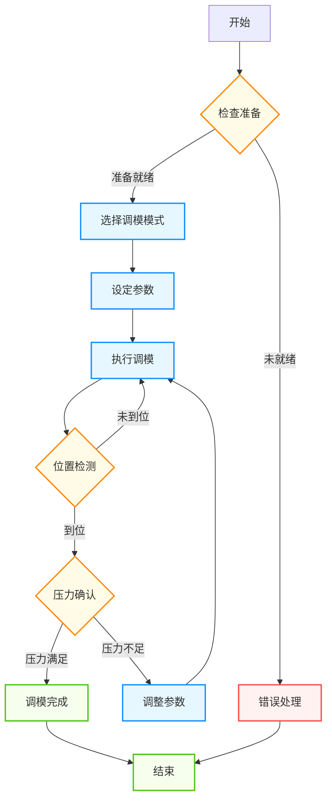

# 注塑机调模功能整理文档

## 1. 功能概述

  
🎯

  <strong>核心功能</strong>
  
调模功能是注塑机的重要功能之一，用于调整模具的闭合距离和锁模力，以适应不同规格的模具和产品生产需求。通过精确的调模控制，可以确保模具闭合紧密，避免产品出现飞边、毛刺等缺陷，同时防止模具和设备受到损坏。

## 2. 功能组成

### 2.1 调模模式

  <h4>调模模式</h4>
  <ul>
    <li><strong>手动调模</strong>：通过操作面板手动控制调模电机的前进和后退，适用于需要精细调整的场景</li>
    <li><strong>自动调模</strong>：设定参数后自动完成调模过程，提高生产效率</li>
    <li><strong>电子尺调模</strong>：利用电子尺进行精确定位调模，实现更高精度的位置控制</li>
  </ul>

### 2.2 调模方向

  <h4>调模方向</h4>
  <ul>
    <li><strong>调模进</strong>：减小模具闭合距离，增加锁模力，用于模具厚度较小的情况</li>
    <li><strong>调模退</strong>：增大模具闭合距离，减小锁模力，用于模具厚度较大的情况</li>
  </ul>

### 2.3 调模控制

  <h4>调模控制</h4>
  <ul>
    <li><strong>调模速度控制</strong>：调整调模电机的运行速度，根据不同阶段需要设置不同速度</li>
    <li><strong>调模压力控制</strong>：控制调模过程中的系统压力，确保调模过程平稳</li>
    <li><strong>调模位置控制</strong>：精确控制调模的位置，确保模具闭合精度</li>
  </ul>

## 3. 参数说明

### 3.1 调模位置参数

  
📏

  <strong>位置参数</strong>
  
调模位置参数是确保模具正确闭合的关键，需要根据模具规格进行合理设置。

| 参数名称 | 说明 | 设定建议 |
| -------- | ---- | -------- |
| 调模位置设定 | 目标调模位置 | 根据模具实际厚度设定 |
| 调模前限 | 调模前进的最大位置限制 | 设定为设备机械极限的90% |
| 调模后限 | 调模后退的最大位置限制 | 设定为设备机械极限的90% |
| 调模原点位置 | 调模的基准位置 | 设备安装时设定，定期校准 |

### 3.2 调模速度参数

  
⚡

  <strong>速度参数</strong>
  
调模速度参数直接影响调模效率和精度，需要根据模具情况进行调整。

| 参数名称 | 说明 | 设定建议 |
| -------- | ---- | -------- |
| 调模快速速度 | 调模的快速运行速度 | 大型模具：10-15mm/s，小型模具：15-20mm/s |
| 调模慢速速度 | 调模的慢速运行速度 | 5-10mm/s，用于接近目标位置时 |
| 调模精确定位速度 | 最终定位时的速度 | 1-3mm/s，确保定位精度 |

### 3.3 调模压力参数

  
💪

  <strong>压力参数</strong>
  
调模压力参数确保调模过程的平稳性和安全性，避免设备过载。

| 参数名称 | 说明 | 设定建议 |
| -------- | ---- | -------- |
| 调模压力设定 | 调模过程中的系统压力设定 | 一般为系统额定压力的50-70% |
| 调模低压压力 | 低压调模时的压力设定 | 一般为系统额定压力的30-50% |

### 3.4 调模时间参数

  
⏱️

  <strong>时间参数</strong>
  
调模时间参数确保调模过程在合理时间内完成，防止设备故障。

| 参数名称 | 说明 | 设定建议 |
| -------- | ---- | -------- |
| 调模限时 | 单次调模操作的最大允许时间 | 30-60秒，根据设备规格调整 |
| 调模定位时间 | 调模完成后的定位保持时间 | 2-5秒，确保位置稳定 |

## 4. 控制流程

### 4.1 调模流程图

### 4.2 调模步骤详解

1. **调模准备**：确认模具安装正确，系统压力正常，安全门关闭
2. **选择调模模式**：根据需要选择手动、自动或电子尺调模模式
3. **设定参数**：根据模具规格设定调模位置、速度、压力等参数
4. **执行调模**：按照设定方向进行调模操作
5. **检测到位**：通过电子尺或限位开关检测调模是否达到目标位置
6. **压力确认**：确认锁模力是否满足要求，必要时进行调整
7. **完成调模**：调模完成后锁定参数，准备生产

## 5. 参数调整原则

### 5.1 位置参数调整

  <h4>位置调整原则</h4>
  <ul>
    <li>调模位置应根据模具厚度进行设置，确保模具完全闭合</li>
    <li>新模具首次使用时应预留足够的安全距离，避免压坏模具</li>
    <li>调模前限和后限应根据设备机械结构进行合理设置，避免机械损坏</li>
    <li>定期校准调模原点位置，确保定位精度</li>
  </ul>

### 5.2 速度和压力参数调整

  <h4>速度和压力调整原则</h4>
  <ul>
    <li>调模速度应根据模具大小和重量适当调整，大型模具应使用较慢的速度</li>
    <li>调模压力应足够但不宜过高，避免设备过载和能源浪费</li>
    <li>调模过程中应根据阶段调整速度，接近目标位置时使用慢速</li>
    <li>不同模具类型可能需要不同的压力设置，应根据实际情况调整</li>
  </ul>

### 5.3 调模精度控制

  
🎯

  <strong>精度控制</strong>
  
调模精度直接影响产品质量和模具寿命，需要特别关注。

1. **最终定位应使用慢速**：确保定位精度，减少位置偏差
2. **使用电子尺反馈**：实时监控调模位置，提高控制精度
3. **定期校准**：定期校准电子尺和机械限位，确保测量准确性
4. **重要产品生产前检查**：对调模精度进行检查和确认，确保产品质量
5. **记录参数**：记录不同模具的调模参数，便于下次使用时参考

## 6. 功能实现

### 6.1 控制逻辑

  
🧠

  <strong>控制逻辑</strong>
  
调模功能的控制逻辑是实现精确调模的关键，需要合理设计。

1. **调模电机的正反转控制**：通过继电器或变频器控制调模电机的正反转
2. **位置检测和反馈**：使用电子尺或编码器实时检测调模位置
3. **速度切换控制**：根据调模位置自动切换速度，实现多段速控制
4. **压力监控和保护**：实时监控调模过程中的压力，防止过载
5. **限位保护**：设置机械和电气限位，防止调模超程

### 6.2 实现建议

  
💡

  <strong>实现建议</strong>
  
以下是调模功能实现的一些建议，有助于提高系统性能。

1. **采用闭环控制**：使用位置反馈实现闭环控制，提高调模精度
2. **增加提示功能**：调模到位时提供声音或灯光提示，方便操作
3. **实现参数记忆**：存储不同模具的调模参数，提高换模效率
4. **添加监控画面**：实现调模过程的实时监控画面，直观显示调模状态
5. **远程调试支持**：支持通过网络远程调试和监控调模过程
6. **故障诊断功能**：内置故障诊断功能，快速定位调模异常

## 7. 注意事项

### 7.1 安全注意事项

  
⚠️

  <strong>安全注意事项</strong>
  
调模操作涉及机械运动，需要特别注意安全。

1. **调模前检查**：确保模具和设备处于安全状态，安全门关闭
2. **避免过载**：调模压力不应超过设备额定值，避免设备损坏
3. **定期维护**：定期检查调模机构的机械部件和传感器，确保正常运行
4. **参数保护**：关键参数应设置合理的上下限，防止误操作
5. **紧急停止**：发生异常时应立即停止调模操作，避免事故
6. **人员培训**：操作人员应经过培训，熟悉调模操作流程和安全注意事项

### 7.2 操作注意事项

  
🔍

  <strong>操作注意事项</strong>
  
正确的操作方法可以提高调模效率和精度。

1. **模具安装**：模具安装应正确，确保平行度和垂直度
2. **参数设定**：根据模具规格合理设定调模参数，避免盲目操作
3. **渐进调整**：调模过程应循序渐进，避免一次性调整过大
4. **观察反馈**：调模过程中应密切观察设备反馈，及时发现异常
5. **记录保存**：重要模具的调模参数应记录保存，便于下次使用
6. **清洁维护**：定期清洁调模机构，防止灰尘和杂物影响精度

## 8. 故障排除

### 8.1 常见故障及解决方法

  
❌

  <strong>故障排除</strong>
  
调模过程中可能出现的常见故障及解决方法。

| 故障现象 | 可能原因 | 解决方法 |
| -------- | -------- | -------- |
| 调模无动作 | 电源故障、电机故障、控制线路故障 | 检查电源、电机和控制线路 |
| 调模速度异常 | 速度参数设置错误、电机故障、负载过大 | 检查速度参数、电机和负载情况 |
| 调模位置偏差大 | 电子尺校准错误、机械间隙过大、参数设置错误 | 校准电子尺、调整机械间隙、检查参数设置 |
| 调模压力异常 | 压力参数设置错误、液压系统故障、传感器故障 | 检查压力参数、液压系统和传感器 |
| 调模超时 | 目标位置设置错误、机械卡滞、负载过大 | 检查目标位置设置、机械状态和负载情况 |
| 调模噪音大 | 机械润滑不足、部件磨损、安装松动 | 加强润滑、更换磨损部件、紧固松动部件 |

### 8.2 故障诊断流程

1. **观察现象**：详细观察调模过程中的异常现象
2. **检查参数**：检查调模参数设置是否正确
3. **检查硬件**：检查电机、传感器、液压系统等硬件状态
4. **测试功能**：逐步测试调模功能的各个环节
5. **分析原因**：根据测试结果分析故障原因
6. **采取措施**：根据故障原因采取相应的解决措施
7. **验证效果**：故障排除后验证调模功能是否正常

## 9. 相关文档

### 9.1 技术文档

  
📚

  <strong>技术文档</strong>
  
相关的技术文档，提供更详细的技术信息。

- 《技术实现文档.md》：调模功能的技术实现细节
- 《注塑机触摸屏界面详细说明.md》：触摸屏上的调模操作界面
- 《调试指南.md》：调模功能的调试和故障排除
- 《参数配置索引.md》：调模相关参数的配置索引

### 9.2 参考标准

  
📋

  <strong>参考标准</strong>
  
调模功能设计和实现的参考标准。

- GB/T 12783-2000 《塑料注射成型机》
- GB 22530-2008 《塑料注射成型机安全要求》
- ISO 20430:2018 《Plastics and rubber machines - Injection moulding machines - Safety requirements》

## 10. 文档信息

**适用范围**：立式注塑机调模功能开发项目
**数据定义基准**：数据定义初版.st v1.0

### 10.1 版本控制

  <h4>版本历史</h4>
  
文档的版本变更记录，跟踪文档的演进过程。

| 版本 | 日期       | 作者      | 变更说明                                                                                         |
| ---- | ---------- | --------- | ------------------------------------------------------------------------------------------------ |
| 1.0  | 2025-08-17 | 汪工      | 初始版本，完成基本功能描述                                                                       |
| 1.1  | 2025-10-09 | 汪工      | 完善功能描述，添加详细参数说明                                                                   |
| 1.2  | 2026-03-17 | 周工/汪工 | 调整文档结构，优化内容组织； 更新数据结构定义，确保与代码一致性； 优化文档格式，添加页内导航支持 |
| 1.3  | 2026-03-23 | 周工/汪工 | 简化变量名称，添加提示信息，提高代码可读性和一致性； 优化Mermaid图表样式 |