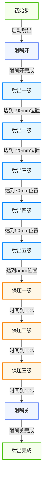
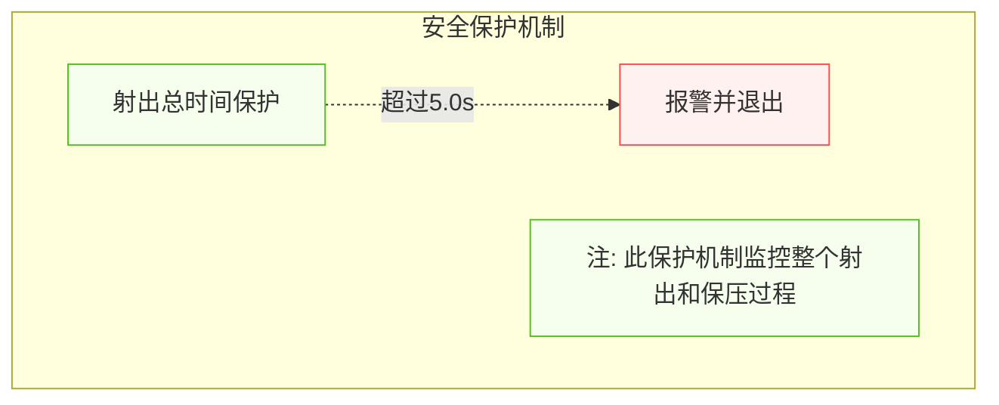

# 注塑机射出功能整理

## 文档信息
- **版本**: 1.0
- **更新日期**: 2025-12-10
- **适用平台**: Beremiz PLC编程环境
- **文档状态**: 已完成

---

## 0. 数据传输说明

**重要**：由于HMI与PLC通过MODBUS协议进行数据交互时，参数是以整数形式传输的，因此程序中的参数类型定义为INT而非REAL。在HMI上显示为带小数点的数值，但实际传输到PLC的数据是乘以相应系数的整数值。

## 1. 功能概述

<div class="info-card">
  <div class="icon">⚡</div>
  <strong>核心功能</strong>
  <p>射出功能是注塑机的核心功能之一，负责将熔融状态的塑料通过注射螺杆高压高速地注入模具型腔。射出过程的控制精度直接影响产品的质量、尺寸稳定性和生产效率。本功能通过精确控制射出压力、速度、位置和时间等参数，实现高质量的塑料注射成型。</p>
</div>

## 2. 功能组成

### 2.1 射出阶段

<div class="feature-block">
  <h4>射出阶段</h4>
  <ul>
    <li><strong>射出一级</strong>：初始慢速射出阶段，确保塑料平稳进入模具</li>
    <li><strong>射出二级</strong>：加速射出阶段，提高填充速度</li>
    <li><strong>射出三级</strong>：高速射出阶段，快速填充模具型腔</li>
    <li><strong>射出四级</strong>：过渡阶段，为最终填充做准备</li>
    <li><strong>射出五级</strong>：最终填充阶段，确保模具完全充满</li>
    <li><strong>保压阶段</strong>：维持压力补充收缩阶段，包括三级保压控制</li>
  </ul>
</div>

### 2.2 射嘴动作

<div class="feature-block">
  <h4>射嘴动作</h4>
  <ul>
    <li><strong>射嘴开</strong>：射出前自动开启射嘴，确保物料能够顺利注入模具</li>
    <li><strong>射嘴关</strong>：射出完成后自动关闭射嘴，防止物料泄漏</li>
  </ul>
</div>

### 2.3 射出检测

<div class="feature-block">
  <h4>射出检测</h4>
  <ul>
    <li><strong>射出终点检测</strong>：记录前20模射出终点位置，自动计算平均值作为检测点</li>
    <li><strong>偏差判断</strong>：第21模及以后，检查射出终点位置与检测点的偏差</li>
    <li><strong>报警处理</strong>：超出允许偏差范围时，触发射出失败报警</li>
  </ul>
</div>

## 3. 控制流程图

### 3.1 射出过程流程图（SFC风格）



### 3.2 射出安全保护机制



## 4. 参数说明与映射表

### 4.1 射出参数映射表

#### 4.1.1 射出一级参数映射

<div class="info-card">
  <div class="icon">🎯</div>
  <strong>射出一级参数</strong>
  <p>射出一级是初始慢速射出阶段，确保塑料平稳进入模具，避免产生气穴。</p>
</div>

| 触摸屏显示 | 程序变量名 | 默认值(PLC侧) | HMI显示值 | 单位 | 功能说明 |
|----------|-----------|--------------|----------|------|--------|
| 射一压力 | Injection1stStagePressureParam | 250 | 25.0 | bar | 射出一级阶段的压力设置 |
| 射一流量 | Injection1stStageFlowParam | 280 | 28.0 | % | 射出一级阶段的流量设置 |
| 射一位置 | Injection1stStagePosParam | 1900 | 190.0 | mm | 射出一级结束位置，在此位置切换到二级速度 |

#### 4.1.2 射出二级参数映射

<div class="info-card">
  <div class="icon">⚡</div>
  <strong>射出二级参数</strong>
  <p>射出二级是加速射出阶段，提高填充速度，缩短填充时间。</p>
</div>

| 触摸屏显示 | 程序变量名 | 默认值(PLC侧) | HMI显示值 | 单位 | 功能说明 |
|----------|-----------|--------------|----------|------|--------|
| 射二压力 | Injection2ndStagePressureParam | 250 | 25.0 | bar | 射出二级阶段的压力设置 |
| 射二流量 | Injection2ndStageFlowParam | 280 | 28.0 | % | 射出二级阶段的流量设置 |
| 射二位置 | Injection2ndStagePosParam | 1200 | 120.0 | mm | 射出二级结束位置，在此位置切换到三级速度 |

#### 4.1.3 射出三级参数映射

<div class="info-card">
  <div class="icon">🚀</div>
  <strong>射出三级参数</strong>
  <p>射出三级是高速射出阶段，快速填充模具型腔，确保模具完全充满。</p>
</div>

| 触摸屏显示 | 程序变量名 | 默认值(PLC侧) | HMI显示值 | 单位 | 功能说明 |
|----------|-----------|--------------|----------|------|--------|
| 射三压力 | Injection3rdStagePressureParam | 270 | 27.0 | bar | 射出三级阶段的压力设置 |
| 射三流量 | Injection3rdStageFlowParam | 280 | 28.0 | % | 射出三级阶段的流量设置 |
| 射三位置 | Injection3rdStagePosParam | 700 | 70.0 | mm | 射出三级结束位置，在此位置切换到四级速度 |

#### 4.1.4 射出四级参数映射

<div class="info-card">
  <div class="icon">🔄</div>
  <strong>射出四级参数</strong>
  <p>射出四级是过渡阶段，为最终填充做准备，调整填充速度和压力。</p>
</div>

| 触摸屏显示 | 程序变量名 | 默认值(PLC侧) | HMI显示值 | 单位 | 功能说明 |
|----------|-----------|--------------|----------|------|--------|
| 射四压力 | Injection4thStagePressureParam | 380 | 38.0 | bar | 射出四级阶段的压力设置 |
| 射四流量 | Injection4thStageFlowParam | 280 | 28.0 | % | 射出四级阶段的流量设置 |
| 射四位置 | Injection4thStagePosParam | 500 | 50.0 | mm | 射出四级结束位置，在此位置切换到五级速度 |

#### 4.1.5 射出五级参数映射

<div class="info-card">
  <div class="icon">🎯</div>
  <strong>射出五级参数</strong>
  <p>射出五级是最终填充阶段，确保模具完全充满，为保压阶段做准备。</p>
</div>

| 触摸屏显示 | 程序变量名 | 默认值(PLC侧) | HMI显示值 | 单位 | 功能说明 |
|----------|-----------|--------------|----------|------|--------|
| 射五压力 | Injection5thStagePressureParam | 390 | 39.0 | bar | 射出五级阶段的压力设置 |
| 射五流量 | Injection5thStageFlowParam | 290 | 29.0 | % | 射出五级阶段的流量设置 |
| 射五位置 | Injection5thStagePosParam | 50 | 5.0 | mm | 射出五级结束位置，在此位置切换到保压 |

#### 4.1.6 保压参数映射

<div class="info-card">
  <div class="icon">💪</div>
  <strong>保压参数</strong>
  <p>保压阶段是维持压力补充收缩阶段，确保制品尺寸稳定，防止收缩。</p>
</div>

| 触摸屏显示 | 程序变量名 | 默认值(PLC侧) | HMI显示值 | 单位 | 功能说明 |
|----------|-----------|--------------|----------|------|--------|
| 保压一压力 | Packing1stStagePressureParam | 360 | 36.0 | bar | 保压一级阶段的压力设置 |
| 保压一流量 | Packing1stStageFlowParam | 280 | 28.0 | % | 保压一级阶段的流量设置 |
| 保压一时间 | Packing1stStageTimeParam | 10 | 1.0 | s | 保压一级持续时间 |
| 保压二压力 | Packing2ndStagePressureParam | 460 | 46.0 | bar | 保压二级阶段的压力设置 |
| 保压二流量 | Packing2ndStageFlowParam | 280 | 28.0 | % | 保压二级阶段的流量设置 |
| 保压二时间 | Packing2ndStageTimeParam | 10 | 1.0 | s | 保压二级持续时间 |
| 保压三压力 | Packing3rdStagePressureParam | 350 | 35.0 | bar | 保压三级阶段的压力设置 |
| 保压三流量 | Packing3rdStageFlowParam | 150 | 15.0 | % | 保压三级阶段的流量设置 |
| 保压三时间 | Packing3rdStageTimeParam | 10 | 1.0 | s | 保压三级持续时间 |

#### 4.1.7 射嘴动作参数映射

<div class="info-card">
  <div class="icon">🔧</div>
  <strong>射嘴动作参数</strong>
  <p>射嘴动作参数控制射嘴的开启和关闭，确保物料能够顺利注入模具并防止泄漏。</p>
</div>

| 触摸屏显示 | 程序变量名 | 默认值(PLC侧) | HMI显示值 | 单位 | 功能说明 |
|----------|-----------|--------------|----------|------|--------|
| 油压射嘴 | UseOilPressureNozzleParam | 0 | 0 | 无 | 油压射嘴使用选择：0-不用，1-使用 |
| 射嘴开压力 | NozzleOpenPressureParam | 250 | 25.0 | bar | 射嘴打开的压力设置 |
| 射嘴开流量 | NozzleOpenFlowParam | 200 | 20.0 | % | 射嘴打开的流量设置 |
| 射嘴开时间 | NozzleOpenTimeParam | 10 | 1.0 | s | 射嘴打开的时间设置 |
| 射嘴关压力 | NozzleClosePressureParam | 360 | 36.0 | bar | 射嘴关闭的压力设置 |
| 射嘴关流量 | NozzleCloseFlowParam | 270 | 27.0 | % | 射嘴关闭的流量设置 |
| 射嘴关时间 | NozzleCloseTimeParam | 10 | 1.0 | s | 射嘴关闭的时间设置 |

#### 4.1.8 射出检测参数映射

<div class="info-card">
  <div class="icon">📊</div>
  <strong>射出检测参数</strong>
  <p>射出检测参数用于监控射出过程的稳定性，确保产品质量。</p>
</div>

| 触摸屏显示 | 程序变量名 | 默认值(PLC侧) | HMI显示值 | 单位 | 功能说明 |
|----------|-----------|--------------|----------|------|--------|
| 射出检测 | UseInjectionDetectionParam | 0 | 0 | 无 | 射出检测使用选择：0-不用，1-使用 |
| 允许偏差 | InjectionDetectionToleranceParam | 50 | 5.0 | mm | 射出终点位置允许的偏差范围 |
| 检测点 | InjectionDetectionPointParam | 0 | 0.0 | mm | 射出终点检测点，前20模自动计算平均值 |

#### 4.1.9 射出控制参数映射

<div class="info-card">
  <div class="icon">⚙️</div>
  <strong>射出控制参数</strong>
  <p>射出控制参数用于控制射出过程的方式和条件，确保射出过程的稳定性和安全性。</p>
</div>

| 触摸屏显示 | 程序变量名 | 默认值(PLC侧) | HMI显示值 | 单位 | 功能说明 |
|----------|-----------|--------------|----------|------|--------|
| 射出总时 | InjectionTotalTimeParam | 50 | 5.0 | s | 从射出动作开始就开始计时，代表射出和保压动作的总时间，正常情况下应大于实际射出时间，作为保护机制 |
| 射出方式 | InjectionModeParam | 1 | 1 | 无 | 射出控制方式选择：1-时间模式，2-电子尺位置模式，3-行程模式1，4-行程模式2 |
| 电子尺使能 | UseScrewADParam | 0 | 0 | 无 | 是否使用电子尺：0-不使用，1-使用 |
| 行程模式 | StrokeModeParam | 1 | 1 | 无 | 行程控制模式选择：0-模式一，1-模式二 |
| 转保压方式 | TransferToPackingModeParam | 1 | 1 | 无 | 转保压方式选择：1-位置控制，2-压力控制，3-时间控制 |
| 转保压位置 | TransferToPackingPosParam | 0 | 0.0 | mm | 转保压的位置条件 |
| 转保压压力 | TransferToPackingPressureParam | 0 | 0.0 | bar | 转保压的压力条件 |
| 转保压时间 | TransferToPackingTimeParam | 0 | 0.0 | s | 转保压的时间条件 |
| 射压 | InjectionPressure | 0 | 0.0 | bar | 当前射出压力显示 |
| 螺杆位置 | ScrewPosition | 0 | 0.0 | mm | 当前螺杆实际位置 |

## 5. 注射模式详细说明

### 5.1 四种注射模式概述

<div class="success-card">
  <div class="icon">🎯</div>
  <strong>注射模式</strong>
  <p>射出功能支持四种不同的注射模式，系统会根据实际硬件配置和工艺需求自动选择合适的模式。</p>
</div>

| 模式编号 | 模式名称 | 硬件要求 | 适用场景 |
|--------|---------|---------|--------|
| 1 | 时间模式 | 无特殊要求 | 适用于简单制品或调试阶段 |
| 2 | 电子尺位置模式 | 电子尺传感器 | 适用于高精度复杂制品 |
| 3 | 行程模式1 | 行程开关 | 适用于中精度制品，硬件成本较低 |
| 4 | 行程模式2 | 行程开关 | 适用于特定工艺需求的制品 |

### 5.2 各模式详细工作原理

#### 5.2.1 时间模式（模式1）

<div class="feature-block">
  <h4>时间模式</h4>
  <ul>
    <li><strong>控制方式</strong>：完全按照设定的时间序列执行注射过程</li>
    <li><strong>切换条件</strong>：各段设定时间完成后自动切换到下一阶段</li>
    <li><strong>特点</strong>：控制简单，无需额外传感器，但精度相对较低</li>
    <li><strong>应用</strong>：适合简单制品或设备调试阶段</li>
  </ul>
</div>

#### 5.2.2 电子尺位置模式（模式2）

<div class="feature-block">
  <h4>电子尺位置模式</h4>
  <ul>
    <li><strong>控制方式</strong>：通过电子尺反馈的实际位置控制各段切换</li>
    <li><strong>切换条件</strong>：达到设定位置时自动切换到下一阶段</li>
    <li><strong>特点</strong>：控制精度高，可实现复杂工艺曲线</li>
    <li><strong>应用</strong>：适合高精度、复杂形状的制品</li>
  </ul>
</div>

#### 5.2.3 行程模式1（模式3）

<div class="feature-block">
  <h4>行程模式1</h4>
  <ul>
    <li><strong>控制方式</strong>：结合行程开关和时间控制</li>
    <li><strong>切换条件</strong>：
      - 射胶一级转二级：行程开关触发（或射一限时到）
      - 射胶二级转三级、三级转四级、四级转五级、五级转保压：时间控制
    </li>
    <li><strong>特点</strong>：硬件成本较低，控制逻辑相对简单</li>
    <li><strong>应用</strong>：适合中等精度要求的制品</li>
  </ul>
</div>

#### 5.2.4 行程模式2（模式4）

<div class="feature-block">
  <h4>行程模式2</h4>
  <ul>
    <li><strong>控制方式</strong>：结合行程开关和剩余时间控制</li>
    <li><strong>切换条件</strong>：
      - 射胶一级转二级、射胶二级转射胶三级：行程开关触发
      - 射胶三级转保压：根据射胶总时剩下的时间执行
    </li>
    <li><strong>特点</strong>：灵活性高，可适应特定工艺需求</li>
    <li><strong>应用</strong>：适合有特殊工艺要求的制品</li>
  </ul>
</div>

### 5.3 模式自动选择逻辑

<div class="info-card">
  <div class="icon">🧠</div>
  <strong>模式选择逻辑</strong>
  <p>系统会根据以下条件自动选择合适的注射模式，确保最佳的控制效果。</p>
</div>

```pascal
IF gvl_InjectionMode=1 THEN // 已经是时间模式
  gvl_InjectionMode:=1; // 保持时间模式
ELSE
  IF gvl_EnableScrewAD THEN // 检查是否使用电子尺
   gvl_InjectionMode:=2;  // 使用电子尺 → 电子尺位置模式
  ELSE
    IF gvl_StrokeMode=0 THEN 
      gvl_InjectionMode:=3; // 行程模式1
    ELSE
      gvl_InjectionMode:=4; // 行程模式2
    END_IF;
  END_IF;
END_IF;
```

## 6. 参数调整原则

### 6.1 位置参数调整

<div class="feature-block">
  <h4>位置参数调整原则</h4>
  <ul>
    <li>射出位置参数应按照从大到小的顺序设置（射一位置 > 射二位置 > 射三位置 > 射四位置 > 射五位置）</li>
    <li>位置切换点应根据制品形状、壁厚和模具结构调整，确保填充均匀</li>
    <li>对于复杂制品，应增加射出阶段数量，细化位置控制</li>
  </ul>
</div>

### 6.2 压力和流量参数调整

<div class="feature-block">
  <h4>压力和流量参数调整原则</h4>
  <ul>
    <li>射出压力应根据材料流动性、制品复杂度和壁厚设置，确保完全填充但避免过度填充</li>
    <li>射出流量控制填充速度，影响制品表面质量和内部结构</li>
    <li>保压压力应略低于射出压力，确保制品尺寸稳定，防止收缩</li>
    <li>压力和流量应根据材料特性进行调整，不同材料需要不同的参数设置</li>
  </ul>
</div>

### 6.3 时间参数调整

<div class="feature-block">
  <h4>时间参数调整原则</h4>
  <ul>
    <li>保压时间应根据制品壁厚和材料特性调整，确保制品充分冷却成型</li>
    <li>射出总时间应设置为正常射出时间的1.2-1.5倍，作为安全超时保护</li>
    <li>射嘴动作时间应根据实际动作时间调整，确保动作完全到位</li>
  </ul>
</div>

### 6.4 射嘴动作参数调整

<div class="feature-block">
  <h4>射嘴动作参数调整原则</h4>
  <ul>
    <li>射嘴开/关压力应根据射嘴驱动机构的特性调整，确保动作平稳可靠</li>
    <li>射嘴开/关流量控制射嘴动作速度，影响动作的平稳性和响应时间</li>
    <li>射嘴开/关时间应根据射嘴实际动作时间调整，确保动作完全到位</li>
  </ul>
</div>

### 6.5 射出检测参数调整

<div class="feature-block">
  <h4>射出检测参数调整原则</h4>
  <ul>
    <li>允许偏差应根据制品精度要求和设备稳定性调整，确保既能检测出异常情况，又不会频繁误报警</li>
    <li>检测点由系统自动计算前20模的平均值，无需手动设置</li>
    <li>射出检测功能应在生产稳定后启用，避免调试阶段的误报警</li>
  </ul>
</div>

## 7. 功能实现

### 7.1 功能块

<div class="info-card">
  <div class="icon">🔧</div>
  <strong>功能块</strong>
  <p>射出功能的核心实现是FB_Injection功能块，负责控制射出和保压过程。</p>
</div>

- **FB_Injection.st**：射出和保压控制功能块

### 7.2 实现建议

#### 7.2.1 参数定义

**注意**：由于HMI与PLC通过MODBUS协议进行数据交互时，参数是以整数形式传输的，因此程序中的参数类型应定义为INT而非REAL。在使用时，程序内部需要将这些整数值转换为实际物理值（除以相应的系数）。

```pascal
// 射出压力参数
Injection1stStagePressureParam : INT := 250;   // 射出一级压力(bar*10) - 实际值25.0bar
Injection2ndStagePressureParam : INT := 250;   // 射出二级压力(bar*10) - 实际值25.0bar
Injection3rdStagePressureParam : INT := 270;   // 射出三级压力(bar*10) - 实际值27.0bar
Injection4thStagePressureParam : INT := 380;   // 射出四级压力(bar*10) - 实际值38.0bar
Injection5thStagePressureParam : INT := 390;   // 射出五级压力(bar*10) - 实际值39.0bar

// 射出流量参数
Injection1stStageFlowParam : INT := 280;       // 射出一级流量(%*10) - 实际值28.0%
Injection2ndStageFlowParam : INT := 280;       // 射出二级流量(%*10) - 实际值28.0%
Injection3rdStageFlowParam : INT := 280;       // 射出三级流量(%*10) - 实际值28.0%
Injection4thStageFlowParam : INT := 280;       // 射出四级流量(%*10) - 实际值28.0%
Injection5thStageFlowParam : INT := 290;       // 射出五级流量(%*10) - 实际值29.0%

// 射出位置参数
Injection1stStagePosParam : INT := 1900;       // 射出一级位置(mm*10) - 实际值190.0mm
Injection2ndStagePosParam : INT := 1200;       // 射出二级位置(mm*10) - 实际值120.0mm
Injection3rdStagePosParam : INT := 700;        // 射出三级位置(mm*10) - 实际值70.0mm
Injection4thStagePosParam : INT := 500;        // 射出四级位置(mm*10) - 实际值50.0mm
Injection5thStagePosParam : INT := 50;         // 射出五级位置(mm*10) - 实际值5.0mm

// 保压参数
Packing1stStagePressureParam : INT := 360;     // 保压一级压力(bar*10) - 实际值36.0bar
Packing1stStageFlowParam : INT := 280;         // 保压一级流量(%*10) - 实际值28.0%
Packing1stStageTimeParam : INT := 10;          // 保压一级时间(s*10) - 实际值1.0s

Packing2ndStagePressureParam : INT := 460;     // 保压二级压力(bar*10) - 实际值46.0bar
Packing2ndStageFlowParam : INT := 280;         // 保压二级流量(%*10) - 实际值28.0%
Packing2ndStageTimeParam : INT := 10;          // 保压二级时间(s*10) - 实际值1.0s

Packing3rdStagePressureParam : INT := 350;     // 保压三级压力(bar*10) - 实际值35.0bar
Packing3rdStageFlowParam : INT := 150;         // 保压三级流量(%*10) - 实际值15.0%
Packing3rdStageTimeParam : INT := 10;          // 保压三级时间(s*10) - 实际值1.0s

// 射出控制参数
InjectionTotalTimeParam : INT := 50;           // 射出总时间(s*10) - 实际值5.0s
InjectionModeParam : INT := 1;                 // 射出方式(1-行程，0-时间)
StrokeModeParam : INT := 1;                    // 行程模式(1-模式一，2-模式二)
TransferToPackingPosParam : INT := 0;          // 转保压位置(mm*10) - 实际值0.0mm

// 状态监控变量
InjectionPressure : INT := 0;                  // 当前射出压力(bar*10) - 实际值0.0bar
ScrewPosition : INT := 0;                      // 当前螺杆位置(mm*10) - 实际值0.0mm
```

#### 7.2.2 关键控制逻辑

<div class="success-card">
  <div class="icon">🧠</div>
  <strong>控制逻辑</strong>
  <p>射出功能的关键控制逻辑包括多级位置切换控制、保压时间控制和安全保护机制。</p>
</div>

- 射出过程采用多级位置切换控制，根据螺杆位置自动切换不同阶段参数
- 保压过程采用时间控制，按设定时间依次执行不同压力阶段
- 安全保护机制应优先于正常流程执行，确保设备和模具安全

#### 7.2.3 功能块实现要求

- **FB_Injection功能块**：需要实现射出和保压的控制逻辑，包括多段控制、转保压条件判断和安全保护机制
- **参数一致性**：确保触摸屏上修改的参数实时同步到PLC程序中
- **参数存储**：重要参数应保存在PLC的掉电保持区域，确保断电后参数不丢失
- **参数限制**：应对关键参数设置合理的上下限，防止输入错误导致设备损坏

## 8. 注意事项

### 8.1 安全注意事项

<div class="warning-card">
  <div class="icon">⚠️</div>
  <strong>安全注意事项</strong>
  <p>射出操作涉及高压和高温，需要特别注意安全。</p>
</div>

1. **温度控制**：射出前需确认料筒温度达到设定要求，避免材料降解
2. **压力保护**：设置合理的最大压力限制，避免设备过载
3. **速度限制**：过高的射出速度可能导致材料降解或产品缺陷
4. **安全优先级**：射出总时间到达时会触发报警并退出射出过程，而不是转保压，这是一种紧急安全机制
5. **定期维护**：定期检查射出系统的液压元件和机械部件，确保正常运行

### 8.2 操作注意事项

<div class="warning-card">
  <div class="icon">🔍</div>
  <strong>操作注意事项</strong>
  <p>正确的操作方法可以提高射出质量和设备寿命。</p>
</div>

1. **参数一致性**：触摸屏上修改的参数应实时同步到PLC程序中，确保参数一致性
2. **参数存储**：重要参数应保存在PLC的掉电保持区域，确保断电后参数不丢失
3. **参数限制**：应对关键参数设置合理的上下限，防止输入错误导致设备损坏
4. **射出位置顺序**：射出各级位置参数必须按照从大到小的顺序设置，否则会导致控制逻辑混乱
5. **残量监控**：定期检查实际残量与设定值的差异，确保射出稳定性
6. **材料特性**：不同材料需要不同的射出参数设置，应根据材料特性进行调整

## 9. 故障排除

### 9.1 常见故障及解决方法

<div class="danger-card">
  <div class="icon">❌</div>
  <strong>故障排除</strong>
  <p>射出过程中可能出现的常见故障及解决方法。</p>
</div>

| 故障现象 | 可能原因 | 解决方法 |
| -------- | -------- | -------- |
| 射出压力异常 | 压力参数设置错误、液压系统故障、传感器故障 | 检查压力参数、液压系统和传感器 |
| 射出速度异常 | 速度参数设置错误、液压系统故障、负载变化 | 检查速度参数、液压系统和负载情况 |
| 射出位置偏差大 | 电子尺校准错误、机械间隙过大、参数设置错误 | 校准电子尺、调整机械间隙、检查参数设置 |
| 射出超时 | 目标位置设置错误、机械卡滞、负载过大 | 检查目标位置设置、机械状态和负载情况 |
| 保压不足 | 保压压力设置过低、保压时间不足 | 调整保压压力和时间参数 |
| 射嘴动作异常 | 射嘴参数设置错误、液压系统故障 | 检查射嘴参数和液压系统 |
| 射出检测报警 | 允许偏差设置过小、设备不稳定 | 调整允许偏差参数、检查设备状态 |

### 9.2 故障诊断流程

1. **观察现象**：详细观察射出过程中的异常现象
2. **检查参数**：检查射出参数设置是否正确
3. **检查硬件**：检查液压系统、传感器、机械部件等硬件状态
4. **测试功能**：逐步测试射出功能的各个环节
5. **分析原因**：根据测试结果分析故障原因
6. **采取措施**：根据故障原因采取相应的解决措施
7. **验证效果**：故障排除后验证射出功能是否正常

## 10. 相关文档

### 10.1 技术文档

<div class="info-card">
  <div class="icon">📚</div>
  <strong>技术文档</strong>
  <p>相关的技术文档，提供更详细的技术信息。</p>
</div>

- 《功能块实现细节.md》：核心功能块的实现细节
- 《技术实现文档.md》：核心功能的技术实现细节
- 《注塑机触摸屏界面详细说明.md》：触摸屏界面操作说明
- 《调试指南.md》：功能调试和故障排除指南

### 10.2 参考标准

<div class="info-card">
  <div class="icon">📋</div>
  <strong>参考标准</strong>
  <p>射出功能设计和实现的参考标准。</p>
</div>

- GB/T 12783-2000 《塑料注射成型机》
- GB 22530-2008 《塑料注射成型机安全要求》
- ISO 20430:2018 《Plastics and rubber machines - Injection moulding machines - Safety requirements》

## 11. 文档信息

**适用范围**：立式注塑机射出功能开发项目
**数据定义基准**：数据定义初版.st v1.0

### 11.1 版本控制

<div class="feature-block">
  <h4>版本历史</h4>
  <p>文档的版本变更记录，跟踪文档的演进过程。</p>
</div>

| 版本 | 日期       | 作者      | 变更说明                                                                                         |
| ---- | ---------- | --------- | ------------------------------------------------------------------------------------------------ |
| 1.0  | 2025-12-10 | 汪工      | 初始版本，完成基本功能描述                                                                       |
| 1.1  | 2026-01-15 | 汪工      | 完善功能描述，添加详细参数说明                                                                   |
| 1.2  | 2026-03-17 | 周工/汪工 | 调整文档结构，优化内容组织； 更新数据结构定义，确保与代码一致性； 优化文档格式，添加页内导航支持 |
| 1.3  | 2026-03-23 | 周工/汪工 | 简化变量名称，添加提示信息，提高代码可读性和一致性； 优化Mermaid图表样式 |
