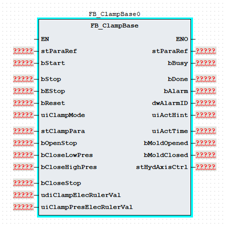
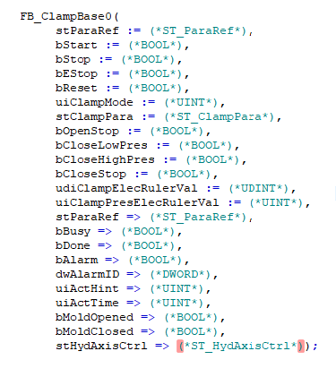

# 《FB_ClampBase 功能块使用说明》

| 项目 | 内容 |
|---|---|
| 模块名称 | `FB_ClampBase` |
| 适用场景 | 注塑机锁模机构的开模、合模、低压保护和高压锁模控制 |
| 版本信息 | 文档版本 1.1；库版本 1.0.0；ABI 1；更新日期 2026-08-13 |
| 事实原则 | 以下描述以当前 ST 执行逻辑为准；源码注释与实际逻辑不一致时标注“需协议确认” |

## 1. 功能概述

`FB_ClampBase` 用于生成锁模轴的阶段控制命令。工程师向它提供开模/合模模式、工艺参数、停止信号、电子尺位置和压力反馈；功能块按状态机输出 `stHydAxisCtrl` 轴命令、完成状态和报警码。

### 输入与输出

| 输入 | 输出 |
|---|---|
| `uiClampMode`、`bStart`、`bStop`、`bEStop`、`bReset` | `bBusy`、`bDone`、`bAlarm`、`dwAlarmID` |
| `stClampPara`、`stParaRef` | `uiActHint`、`uiActTime`、`bMoldOpened`、`bMoldClosed` |
| `bOpenStop`、`bCloseStop`、`bCloseLowPres`、`bCloseHighPres` | `stHydAxisCtrl` |
| `udiClampElecRulerVal`、`uiClampPresElecRulerVal` | — |

### 主要流程

~~~text
复位 / 急停 / 停止
  -> 优先处理并清理主要轴命令

正常启动
  -> Idle -> Init
  -> 开模：OpenUnloadPres -> Opening[0..4] -> Opened
  -> 合模：Closing[0..3] -> CloseLowPres -> CloseHighPres -> Closed
  -> 无效模式或超时：Error
~~~

`FB_ClampBase` 只生成控制命令和状态，不直接调用轴功能块，不访问 `%I/%Q`，不操作液压阀或伺服功率级。液压轴应由外部 `FB_HydAxis` 执行，电动轴应由外部 `FB_EleAxis` 执行，完整调用链见第 8 章。

## 2. 自定义数据类型

### 2.1 `E_ClampState`

该枚举只用于内部状态机，不作为输出接口直接提供。

| 枚举成员 | 当前用途 |
|---|---|
| `eClampState_Idle` | 空闲 |
| `eClampState_Init` | 启动初始化 |
| `eClampState_OpenUnloadPres` | 开模卸荷 |
| `eClampState_Opening` | 开模分段 |
| `eClampState_Opened` | 开模完成 |
| `eClampState_Closing` | 合模分段 |
| `eClampState_CloseLowPres` | 合模低压 |
| `eClampState_CloseHighPres` | 合模高压 |
| `eClampState_Closed` | 合模完成 |
| `eClampState_Error` | 错误保持 |

### 2.2 `ST_ClampSeg`

压力、速度、位置和斜率的物理单位均为“单位源码未定义”。

| 成员 | 类型 | 读写属性 | 对外用途 |
|---|---|---|---|
| `uiPres` | `UINT` | 输入只读 | 压力命令 |
| `uiSpd` | `UINT` | 输入只读 | 速度命令 |
| `udiPos` | `UDINT` | 输入只读 | 位置目标 |
| `uiTime` | `UINT` | 输入只读 | 时间阈值来源 |
| `uiPresGrad` | `UINT` | 输入只读 | 压力斜率 |
| `uiSpdGrad` | `UINT` | 输入只读 | 速度斜率 |

### 2.3 `ST_ClampPara`

每个成员单独列出。`stClampPara` 在每次调用中被读取。

| 成员 | 类型 | 读写属性 | 对外用途 |
|---|---|---|---|
| `uiOpenSegCnt` | `UINT` | 输入只读 | 开模最后有效下标，运行时限制为 `0..4` |
| `uiOpenMode` | `UINT` | 输入只读 | 开模切段方式；`1` 为电子尺比较，`0` 为数字停止 |
| `uiOpenLimitTime` | `UINT` | 输入只读 | 开模总时限阈值 |
| `stOpenUnloadPres` | `ST_ClampSeg` | 输入只读 | 开模卸荷参数 |
| `aOpenSeg` | `ARRAY[0..4] OF ST_ClampSeg` | 输入只读 | 普通开模段参数 |
| `stOpenDebug` | `ST_ClampSeg` | 输入只读 | 开模调模参数 |
| `uiOpenDebugPresStartGrad` | `UINT` | 输入只读 | 开模调模压力启动斜率 |
| `uiOpenDebugPresStopGrad` | `UINT` | 输入只读 | 开模调模压力停止斜率 |
| `uiOpenDebugSpdStartGrad` | `UINT` | 输入只读 | 开模调模速度启动斜率 |
| `uiOpenDebugSpdStopGrad` | `UINT` | 输入只读 | 开模调模速度停止斜率 |
| `uiOpenPresStartGrad` | `UINT` | 输入只读 | 普通开模首段压力启动斜率 |
| `uiOpenPresStopGrad` | `UINT` | 输入只读 | 当前 ST 未读取 |
| `uiOpenSpdStartGrad` | `UINT` | 输入只读 | 普通开模首段速度启动斜率 |
| `uiOpenSpdStopGrad` | `UINT` | 输入只读 | 当前 ST 未读取 |
| `uiCloseSegCnt` | `UINT` | 输入只读 | 合模最后有效下标，运行时限制为 `0..3` |
| `uiCloseMode` | `UINT` | 输入只读 | 合模切段方式；`1` 为电子尺比较，`0` 为数字停止 |
| `uiCloseLimitTime` | `UINT` | 输入只读 | 合模总时限阈值 |
| `uiCloseLowPresLimitTime` | `UINT` | 输入只读 | 合模低压保护时限阈值 |
| `uiCloseEndMode` | `UINT` | 输入只读 | 高压结束方式：时间、行程或压力 |
| `uiCloseEndHighPres` | `UINT` | 输入只读 | 压力结束阈值 |
| `aCloseSeg` | `ARRAY[0..3] OF ST_ClampSeg` | 输入只读 | 普通合模段参数 |
| `stCloseLowPres` | `ST_ClampSeg` | 输入只读 | 合模低压参数 |
| `stCloseHighPres` | `ST_ClampSeg` | 输入只读 | 合模高压参数 |
| `stCloseDebug` | `ST_ClampSeg` | 输入只读 | 合模调模参数 |
| `uiCloseDebugPresStartGrad` | `UINT` | 输入只读 | 合模调模压力启动斜率 |
| `uiCloseDebugPresStopGrad` | `UINT` | 输入只读 | 合模调模压力停止斜率 |
| `uiCloseDebugSpdStartGrad` | `UINT` | 输入只读 | 合模调模速度启动斜率 |
| `uiCloseDebugSpdStopGrad` | `UINT` | 输入只读 | 合模调模速度停止斜率 |
| `uiClosePresStartGrad` | `UINT` | 输入只读 | 普通合模首段压力启动斜率 |
| `uiClosePresStopGrad` | `UINT` | 输入只读 | 当前 ST 未读取 |
| `uiCloseSpdStartGrad` | `UINT` | 输入只读 | 普通合模首段速度启动斜率 |
| `uiCloseSpdStopGrad` | `UINT` | 输入只读 | 当前 ST 未读取 |

### 2.4 `ST_ParaRef`

| 成员 | 类型 | 读写属性 | 对外用途 |
|---|---|---|---|
| `udiPosToleranceValue` | `UDINT` | `VAR_IN_OUT`，FB 只读 | 电子尺位置比较容差 |

### 2.5 `ST_HydAxisCtrl`

压力、速度、位置、力和斜率的物理单位均为“单位源码未定义”。

| 成员 | 类型 | 读写属性 | 对外用途 |
|---|---|---|---|
| `bAxisStart` | `BOOL` | 功能块写入 | 轴启动 |
| `uiAxisDir` | `UINT` | 功能块写入；`1` 为开模，`2` 为合模 | 轴方向 |
| `uiAxisMode` | `UINT` | 功能块写入 | 轴模式 |
| `uiPresCmd` | `UINT` | 功能块写入 | 压力命令 |
| `uiBackPresCmd` | `UINT` | 声明但当前 ST 未写入 | 背压命令 |
| `uiSpdCmd` | `UINT` | 功能块写入 | 速度命令 |
| `uiEndSpdCmd` | `UINT` | 功能块写入 | 结束速度 |
| `udiPosCmd` | `UDINT` | 功能块写入 | 位置命令 |
| `uiForce` | `UINT` | 功能块转存；当前 ST 未赋值 | 力命令 |
| `uiAxisPresAcc` | `UINT` | 功能块写入 | 压力加速 |
| `uiAxisPresDec` | `UINT` | 功能块写入 | 压力减速 |
| `uiAxisSpdAcc` | `UINT` | 功能块写入 | 速度加速 |
| `uiAxisSpdDec` | `UINT` | 功能块写入 | 速度减速 |
| `uiAxisJerk` | `UINT` | 功能块转存 | 加加速度 |

## 3. 功能块接口

  <figure style="flex:1 1 420px; max-width:48%; margin:0; text-align:center;">
    
    <figcaption>LD 功能块接口图</figcaption>
  </figure>
  <figure style="flex:1 1 420px; max-width:48%; margin:0; text-align:center;">
    
    <figcaption>ST 调用图</figcaption>
  </figure>

### 3.1 `VAR_IN_OUT`

| 名称 | 类型 | 当前行为 | 信号含义 |
|---|---|---|---|
| `stParaRef` | `ST_ParaRef` | 电子尺模式下读取，不写入 | 位置参考参数 |

### 3.2 `VAR_INPUT`

| 名称 | 类型 | 当前行为 | 信号含义 |
|---|---|---|---|
| `bStart` | `BOOL` | `Idle` 状态下为 TRUE 时启动初始化 | 启动命令 |
| `bStop` | `BOOL` | 优先级低于复位和急停；回到空闲并清主要轴命令 | 停止命令 |
| `bEStop` | `BOOL` | 优先级低于复位；进入错误并置急停报警 | 急停命令 |
| `bReset` | `BOOL` | 最高优先级；清状态、报警和主要轴命令 | 复位命令 |
| `uiClampMode` | `UINT` | 选择开模、合模或调模方向 | 模式选择 |
| `stClampPara` | `ST_ClampPara` | 每周期读取 | 锁模参数 |
| `bOpenStop` | `BOOL` | `uiOpenMode=0` 时用于开模切段 | 开模停止 |
| `bCloseLowPres` | `BOOL` | `uiCloseMode=0` 时用于低压到位 | 低压到位 |
| `bCloseHighPres` | `BOOL` | `uiCloseEndMode=1` 时用于高压完成 | 高压到位 |
| `bCloseStop` | `BOOL` | `uiCloseMode=0` 时用于合模切段 | 合模停止 |
| `udiClampElecRulerVal` | `UDINT` | 电子尺模式下参与位置比较 | 锁模位置 |
| `uiClampPresElecRulerVal` | `UINT` | `uiCloseEndMode=2` 时参与高压结束判断 | 锁模压力 |

### 3.3 `VAR_OUTPUT`

| 名称 | 类型 | 当前行为 | 信号含义 |
|---|---|---|---|
| `bBusy` | `BOOL` | `Idle` 接收到 `bStart` 后置 TRUE，直到停止、复位、完成或错误 | 忙状态 |
| `bDone` | `BOOL` | 开模或合模完成时置 TRUE，回到 `Idle` 后清除 | 完成状态 |
| `bAlarm` | `BOOL` | 急停、无效模式或错误状态时置 TRUE，复位清除 | 报警状态 |
| `dwAlarmID` | `DWORD` | 报警按位 OR 保持，复位清零 | 报警代码 |
| `uiActHint` | `UINT` | 输出空闲、运行阶段、完成或错误提示 | 动作提示 |
| `uiActTime` | `UINT` | 活动阶段累计调用次数 | 动作时间 |
| `bMoldOpened` | `BOOL` | 开模完成状态置 TRUE，空闲状态清除 | 开模完成 |
| `bMoldClosed` | `BOOL` | 合模完成状态置 TRUE，空闲状态清除 | 合模完成 |
| `stHydAxisCtrl` | `ST_HydAxisCtrl` | 周期末转存当前轴命令 | 轴命令包 |

`stHydAxisCtrl` 的成员在周期末统一转存。轴控制层应以 `stHydAxisCtrl.uiAxisMode` 判断命令有效性，不应把保留值当作新的轴命令。

## 4. ST 内部逻辑

### 4.1 执行优先级

每次调用先依据 `uiClampMode` 计算方向和调模标志，然后按以下优先级处理：

| 优先级 | 条件 | 结果 |
|---:|---|---|
| 1 | `bReset` | 回到空闲、清报警和主要轴命令 |
| 2 | `bEStop` | 进入错误、置 `16#0010`、清主要轴命令 |
| 3 | `bStop` | 回到空闲、清主要轴命令，不清报警码 |
| 4 | 其他 | 执行 `E_ClampState` 状态机 |

### 4.2 开模流程

| 阶段 | 主要条件 | 外部结果 |
|---|---|---|
| `Idle` | `bStart=TRUE` | `bBusy=TRUE`，进入 `Init` |
| `Init` | `uiClampMode=1/3` | 读取开模段下标并进入卸荷 |
| `OpenUnloadPres` | 卸荷累计调用次数达到 `stOpenUnloadPres.uiTime × 100` | `uiActHint=10`，`stHydAxisCtrl.uiAxisMode=3`，输出卸荷或调模命令 |
| `Opening` | 电子尺达到位置或 `bOpenStop` 切段 | `uiActHint=11..15`，输出普通或调模开模命令 |
| `Opened` | 段下标超过 `uiOpenSegCnt` | `stHydAxisCtrl.uiAxisMode=0`，`bDone=TRUE`，`bMoldOpened=TRUE`，提示 2 |

开模总时限达到 `uiOpenLimitTime × 1000` 次调用时置 `16#1001` 并进入错误状态。普通开模第 0 段的启动斜率来自 `uiOpenPresStartGrad`/`uiOpenSpdStartGrad`，后续段使用前一段加速斜率和当前段减速斜率。

### 4.3 合模流程

| 阶段 | 主要条件 | 外部结果 |
|---|---|---|
| `Init` | `uiClampMode=2/4` | 读取合模段下标并进入合模分段 |
| `Closing` | 电子尺达到位置或 `bCloseStop` 切段 | `uiActHint=21..24`，输出普通或调模合模命令 |
| `CloseLowPres` | 电子尺达到低压位置或 `bCloseLowPres` | `uiActHint=30`，`stHydAxisCtrl.uiAxisMode=3` |
| `CloseHighPres` | 按时间、`bCloseHighPres` 或压力阈值结束 | `uiActHint=31`，`stHydAxisCtrl.uiAxisMode=3` |
| `Closed` | 高压结束条件满足 | `stHydAxisCtrl.uiAxisMode=0`，`bDone=TRUE`，`bMoldClosed=TRUE`，提示 3 |

合模分段总时限达到 `uiCloseLimitTime × 1000` 次调用时置 `16#1002`；低压阶段达到 `uiCloseLowPresLimitTime × 1000` 次调用时置 `16#1000`。高压结束方式由 `uiCloseEndMode` 选择：0 时间、1 数字到位、2 压力反馈。

### 4.4 调模和启动脉冲

模式 3/4 使用 `stOpenDebug` 或 `stCloseDebug` 的压力、速度和位置。`stHydAxisCtrl.bAxisStart` 在每个活动阶段的前 20 次调用为 TRUE，随后为 FALSE；`bBusy` 则从动作启动保持到动作结束、停止、复位或错误。两者用途不同，不能互换。

## 5. 报警和状态码

### 5.1 报警代码与报警信息

| 报警代码 | 报警信息 |
|---|---|
| `16#0000` | 无报警 |
| `16#0008` | `uiClampMode` 参数无效 |
| `16#0010` | 紧急停止 |
| `16#1000` | 低压保护时间到 |
| `16#1001` | 开模未定时完成 |
| `16#1002` | 合模未定时完成 |

报警行为说明：

1. `16#0008` 在 `Init` 中检测到无效模式时置位，并立即进入错误状态。
2. `16#0010` 在 `bEStop=TRUE` 时置位；急停保持时，报警会在后续调用继续出现。
3. `16#1000`、`16#1001`、`16#1002` 在对应计时达到阈值时按位 OR；随后错误状态置 `bAlarm=TRUE`。
4. `dwAlarmID` 保持已置位位，`bStop`、完成状态和回到 `Idle` 不清报警。
5. `bReset` 最高优先级，清 `bAlarm` 和 `dwAlarmID`；若急停仍有效，下一调用会再次置位。
6. 反馈异常未被源码映射为其他报警码时，写明“当前未实现为功能块报警”。

### 5.2 动作状态码

| `uiActHint` | 含义 |
|---:|---|
| 0 | 空闲 |
| 1 | 错误 |
| 2 | 开模完成 |
| 3 | 合模完成 |
| 10 | 开模卸荷 |
| 11..15 | 开模第 1..5 段 |
| 21..24 | 合模第 1..4 段 |
| 30 | 合模低压 |
| 31 | 合模高压 |

`uiActHint` 是动作提示，不等同于 `dwAlarmID`，也不等同于内部 `E_ClampState`。

## 6. 调用规范和注意事项

1. 在固定周期内调用一次。阶段时间实际按调用次数累加；`uiTime × 100` 和限制时间 `×1000` 都必须结合实际调用周期换算。
2. `uiOpenSegCnt` 和 `uiCloseSegCnt` 是最后有效下标，不是段数；开模配置范围为 `0..4`，合模配置范围为 `0..3`。
3. `uiOpenMode`/`uiCloseMode` 取值 1 时使用电子尺位置比较，取值 0 时使用数字停止信号；模式、位置和单位应由轴控制协议确认。
4. `bStart` 只在 `Idle` 中启动；完成状态会保持，下一次动作应先回到 `Idle`。
5. `bBusy` 表示动作过程，`stHydAxisCtrl.bAxisStart` 只表示阶段启动窗口；轴功能块的 `bStart` 应连接 `stHydAxisCtrl.bAxisStart`，不能连接 `bBusy`。
6. `bStop` 清主要轴命令但不清报警；`bReset` 才清报警和状态。复位优先级高于急停。
7. 伺服系统中的液压轴调用 `FB_HydAxis`，电动轴调用 `FB_EleAxis`。本功能块通过 `stHydAxisCtrl` 输出轴命令，不承担轴闭环和硬件安全保护。
8. 轴控制层应以 `stHydAxisCtrl.uiAxisMode` 判断命令有效性；`uiAxisDir`、`uiForce`、斜率输出、`uiAxisJerk` 和当前未写入的 `uiBackPresCmd` 可能保留上一次值，不能单独作为有效命令。
9. 本功能块不直接切断物理能量，不替代独立急停、安全继电器、轴故障处理或限位保护。
10. 机器级调用层应先根据开模/合模请求生成 `bStart` 和 `uiClampMode`，再调用本功能块；采用下降沿停止脉冲时，可将 `bStart` 的下降沿与 `bStop` 进行 OR 后传入。

## 7. 外部交互边界

| 方向 | 交互对象 | 数据边界 |
|---|---|---|
| 输入 | HMI/配方 | `uiClampMode`、`stClampPara`、`stParaRef` |
| 输入 | 现场信号转换层 | `bOpenStop`、`bCloseStop`、`bCloseLowPres`、`bCloseHighPres`、电子尺和压力反馈 |
| 输出 | `FB_HydAxis` | `stHydAxisCtrl` 的方向、启动、轴模式、压力、速度、结束速度、位置和斜率成员；轴报警由 `FB_HydAxis.dwAlarmID` 输出 |
| 输出 | `FB_EleAxis` | 当前 POU 接口未声明；不能套用 `FB_HydAxis` 引脚，需按实际电动轴接口确认 |
| 输出 | HMI/诊断/报警 | 忙、完成、动作提示、报警码和开/合模完成状态 |

当前 ST 不调用其他功能块、不访问全局变量、不直接访问 `%I/%Q`，轴功能块调用属于外部集成边界。

## 8. 最小调用示例

示例使用通用占位符，工程师需将其替换为真实对象。上层逻辑先生成 `bStart`、`uiClampMode` 和动作输入，再调用本功能块；`bStart` 下降沿可与 `bStop` 合并为停止脉冲。随后按轴类型选择液压轴或电动轴，液压轴报警通过 `dwAlarmID` 和 `bAlarm` 汇总。

~~~ST
(* 上层动作逻辑先生成 bStart、uiClampMode 和开/合模反馈输入。 *)
fStartFall(CLK := bStart);

(* 先调用锁模工艺功能块；下降沿停止脉冲与外部停止信号合并。 *)
fbExample(
  stParaRef := stParaRef,
  bStart := bStart,
  bStop := bStop OR fStartFall.Q,
  bEStop := bEStop,
  bReset := bReset,
  uiClampMode := uiClampMode,
  stClampPara := stClampPara,
  bOpenStop := bOpenStop,
  bCloseLowPres := bCloseLowPres,
  bCloseHighPres := bCloseHighPres,
  bCloseStop := bCloseStop,
  udiClampElecRulerVal := udiClampElecRulerVal,
  uiClampPresElecRulerVal := uiClampPresElecRulerVal,
  bBusy => bBusy,
  bDone => bDone,
  bAlarm => bAlarm,
  dwAlarmID => dwClampAlarmID,
  uiActHint => uiActHint,
  uiActTime => uiActTime,
  bMoldOpened => bMoldOpened,
  bMoldClosed => bMoldClosed,
  stHydAxisCtrl => stHydAxisCtrl
);

(* 伺服系统中的液压轴调用 FB_HydAxis。 *)
IF bUseHydAxis THEN
  fbHydAxisExample(
    stHydAxisRef := stHydAxisRef,
    bStart := stHydAxisCtrl.bAxisStart,
    bStop := bStop OR fStartFall.Q,
    bEStop := bEStop,
    bReset := bReset,
    uiDir := stHydAxisCtrl.uiAxisDir,
    uiMode := stHydAxisCtrl.uiAxisMode,
    uiPres := stHydAxisCtrl.uiPresCmd,
    uiSpd := stHydAxisCtrl.uiSpdCmd,
    uiEndSpd := stHydAxisCtrl.uiEndSpdCmd,
    udiPos := stHydAxisCtrl.udiPosCmd,
    uiForce := stHydAxisCtrl.uiForce,
    uiAcc := stHydAxisCtrl.uiAxisSpdAcc,
    uiDec := stHydAxisCtrl.uiAxisSpdDec,
    uiJerk := stHydAxisCtrl.uiAxisJerk,
    dwAlarmID => dwAxisAlarmID
  );

  bAlarmAll := fbExample.bAlarm OR fbHydAxisExample.bAlarm;
ELSE
  (* 电动轴调用 FB_EleAxis；当前 POU 未声明接口，按实际定义补齐。 *)
  fbEleAxisExample();
  bAlarmAll := fbExample.bAlarm;
END_IF;
~~~

`FB_HydAxis` 的加速度/减速度引脚必须按轴功能块真实定义映射；其 `dwAlarmID` 直接作为轴报警代码输出，外部汇总可使用 `fbExample.bAlarm OR fbHydAxisExample.bAlarm`。当前 `FB_EleAxis` POU 没有声明接口，不能套用液压轴引脚名称；轴命令有效性以 `stHydAxisCtrl.uiAxisMode` 为准，`stHydAxisCtrl.bAxisStart` 只作为轴启动窗口信号。
