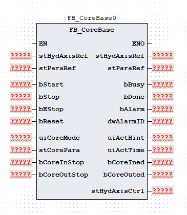
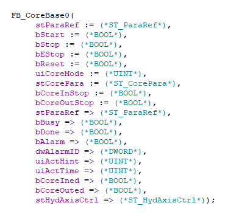

# 《FB_CoreBase 功能块使用说明》

| 项目 | 内容 |
|---|---|
| 模块名称 | `FB_CoreBase` |
| 适用场景 | 注塑机中子进、中子退的单段工艺控制 |
| 版本信息 | 文档版本 1.0；库版本 1.0.0；更新日期 2026-08-20 |
| 事实原则 | 以下描述以当前 ST 执行逻辑为准；注释与实际逻辑不一致时标注“需协议确认” |

## 1. 功能概述

### 功能职责

`FB_CoreBase` 组织中子进和中子退的启动、单段执行、停止、完成及错误流程，将中子参数转换为 `stHydAxisCtrl` 轴命令，并输出动作状态、完成状态和报警结果。功能块支持：

- 中子进和中子退；
- 调模模式下的中子进和中子退；
- 单段压力、速度、时间和计数参数；
- 时间、数字停止反馈或调用计数三种结束方式；
- 普通模式和调模模式分别使用对应的工艺参数或调模参数；
- 中子进/退完成状态、动作提示、报警状态和报警代码输出。

### 输入与输出

| 调用者提供 | 功能块输出 |
|---|---|
| `bStart`、`bStop`、`bEStop`、`bReset`、`uiCoreMode` | `bBusy`、`bDone`、`bAlarm`、`dwAlarmID` |
| `stCorePara` | `uiActHint`、`uiActTime`、`bCoreIned`、`bCoreOuted` |
| `stHydAxisRef`、`bCoreInStop`、`bCoreOutStop` | `stHydAxisCtrl` 轴命令和轴状态包；`stHydAxisRef` 调用后回写 |

### 主要执行流程

~~~text
根据 uiCoreMode 派生普通/调模及中子进/退请求
  -> 按优先级处理复位、急停和正常停止
  -> Idle 接收 bStart 后进入 Init
  -> Init 设置方向并进入中子进或中子退
  -> 单段执行：按时间、数字停止或计数结束
  -> 达到限制时间或模式无效 -> Error
  -> 中子进完成或中子退完成保持完成状态
  -> 内部调用 FB_HydAxis，回写 stHydAxisRef 并转存轴命令和轴状态到 stHydAxisCtrl
~~~

### 功能边界

本功能块生成中子工艺状态和轴命令，并在当前 ST 的固定 `IF TRUE` 分支内调用 `FB_HydAxis`；不访问通信报文、全局变量、`%I/%Q` 或物理 I/O，也不实现轴闭环、电子尺合理性检查、独立急停、安全联锁、位置起始条件和物理能量切断。`FB_EleAxis` 分支虽然保留在 ST 中，但当前条件下不会执行；电动轴切换需先修改并核对实际 POU 实现。

## 2. 自定义数据类型

### 2.1 `E_CoreState`

| 枚举成员 | 用途 |
|---|---|
| `eCoreState_Idle` | 空闲 |
| `eCoreState_Init` | 初始化 |
| `eCoreState_CoreIning` | 中子进 |
| `eCoreState_CoreIned` | 中子进完成 |
| `eCoreState_CoreOuting` | 中子退 |
| `eCoreState_CoreOuted` | 中子退完成 |
| `eCoreState_Error` | 错误 |

### 2.2 `ST_CoreSeg`

| 成员 | 类型 | 读写属性 | 用途 |
|---|---|---|---|
| `uiPres` | `UINT` | 只读 | 压力命令 |
| `uiSpd` | `UINT` | 只读 | 速度命令 |
| `uiTime` | `UINT` | 只读 | 时间阈值 |
| `uiCount` | `UINT` | 只读 | 计数阈值 |

### 2.3 `ST_CorePara`

| 成员 | 类型 | 读写属性 | 用途 |
|---|---|---|---|
| `uiCoreFn` | `UINT` | 只读 | 中子功能启用选择 |
| `uiCoreInStartMode` | `UINT` | 只读 | 中子进开始方式 |
| `uiCoreInStroke` | `UINT` | 只读 | 中子进开始行程 |
| `udiCoreInPos` | `UDINT` | 只读 | 中子进开始位置 |
| `uiCoreInStopMode` | `UINT` | 只读 | 中子进停止方式：0 时间，1 行程，2 计数 |
| `uiCoreInLimitTime` | `UINT` | 只读 | 中子进限制时间 |
| `stCoreInSeg` | `ST_CoreSeg` | 只读 | 中子进参数 |
| `stCoreInDebug` | `ST_CoreSeg` | 只读 | 中子进调模参数 |
| `uiCoreInDebugPresStartGrad` | `UINT` | 只读 | 中子进调模压力启动斜率 |
| `uiCoreInDebugPresStopGrad` | `UINT` | 只读 | 中子进调模压力停止斜率 |
| `uiCoreInDebugSpdStartGrad` | `UINT` | 只读 | 中子进调模速度启动斜率 |
| `uiCoreInDebugSpdStopGrad` | `UINT` | 只读 | 中子进调模速度停止斜率 |
| `uiCoreInPresStartGrad` | `UINT` | 只读 | 中子进压力启动斜率 |
| `uiCoreInPresStopGrad` | `UINT` | 只读 | 中子进压力停止斜率 |
| `uiCoreInSpdStartGrad` | `UINT` | 只读 | 中子进速度启动斜率 |
| `uiCoreInSpdStopGrad` | `UINT` | 只读 | 中子进速度停止斜率 |
| `uiCoreOutStartMode` | `UINT` | 只读 | 中子退开始方式 |
| `uiCoreOutStroke` | `UINT` | 只读 | 中子退开始行程 |
| `udiCoreOutPos` | `UDINT` | 只读 | 中子退开始位置 |
| `uiCoreOutStopMode` | `UINT` | 只读 | 中子退停止方式：0 时间，1 行程，2 计数 |
| `uiCoreOutLimitTime` | `UINT` | 只读 | 中子退限制时间 |
| `stCoreOutSeg` | `ST_CoreSeg` | 只读 | 中子退参数 |
| `stCoreOutDebug` | `ST_CoreSeg` | 只读 | 中子退调模参数 |
| `uiCoreOutDebugPresStartGrad` | `UINT` | 只读 | 中子退调模压力启动斜率 |
| `uiCoreOutDebugPresStopGrad` | `UINT` | 只读 | 中子退调模压力停止斜率 |
| `uiCoreOutDebugSpdStartGrad` | `UINT` | 只读 | 中子退调模速度启动斜率 |
| `uiCoreOutDebugSpdStopGrad` | `UINT` | 只读 | 中子退调模速度停止斜率 |
| `uiCoreOutPresStartGrad` | `UINT` | 只读 | 中子退压力启动斜率 |
| `uiCoreOutPresStopGrad` | `UINT` | 只读 | 中子退压力停止斜率 |
| `uiCoreOutSpdStartGrad` | `UINT` | 只读 | 中子退速度启动斜率 |
| `uiCoreOutSpdStopGrad` | `UINT` | 只读 | 中子退速度停止斜率 |

### 2.4 `ST_ParaRef`

| 成员 | 类型 | 读写属性 | 用途 |
|---|---|---|---|
| `udiPosToleranceValue` | `UDINT` | 读写 | 位置容差值 |

### 2.5 `ST_HydAxisRef`

该类型由液压轴库定义。`FB_CoreBase` 将其传入内部 `FB_HydAxis`，调用后再回写；结构成员请查阅 HydTechnology 技术库使用说明书。

### 2.6 `ST_HydAxisCtrl`

| 成员 | 类型 | 读写属性 | 用途 |
|---|---|---|---|
| `bAxisStart` | `BOOL` | 只写 | 轴启动信号 |
| `uiAxisDir` | `UINT` | 只写 | 轴方向值；中子进写 2，中子退写 1 |
| `uiAxisMode` | `UINT` | 只写 | 轴控制模式：`1` 位置、`2` 速度、`3` 压力；本功能块设定 `2` |
| `uiPresCmd` | `UINT` | 只写 | 压力命令 |
| `uiSpdCmd` | `UINT` | 只写 | 速度命令 |
| `uiEndSpdCmd` | `UINT` | 只写 | 段结束速度 |
| `udiPosCmd` | `UDINT` | 只写 | 位置命令 |
| `uiAxisPresAcc` | `UINT` | 只写 | 压力加速度参数 |
| `uiAxisPresDec` | `UINT` | 只写 | 压力减速度参数 |
| `uiAxisSpdAcc` | `UINT` | 只写 | 速度加速度参数 |
| `uiAxisSpdDec` | `UINT` | 只写 | 速度减速度参数 |
| `uiAxisJerk` | `UINT` | 只写 | 加加速度参数 |
| `bBusy` | `BOOL` | 内部轴功能块写入 | 液压轴忙状态 |
| `bDone` | `BOOL` | 内部轴功能块写入 | 液压轴完成状态 |
| `bInVelocity` | `BOOL` | 内部轴功能块写入 | 液压轴速度到位状态 |
| `bInPressure` | `BOOL` | 内部轴功能块写入 | 液压轴压力到位状态 |
| `bAlarm` | `BOOL` | 内部轴功能块写入 | 液压轴报警状态 |
| `dwAlarmID` | `DWORD` | 内部轴功能块写入 | 液压轴报警代码 |

## 3. 功能块接口

### 3.1 `VAR_IN_OUT`

| 名称 | 类型 | 当前行为 | 信号含义 |
|---|---|---|---|
| `stHydAxisRef` | `ST_HydAxisRef` | 传入内部 `FB_HydAxis`，调用后回写 | 液压轴参数引用参考 |
| `stParaRef` | `ST_ParaRef` | 引用位置容差值 | 工艺参数引用参考 |

### 3.2 `VAR_INPUT`

| 名称 | 类型 | 当前行为 | 信号含义 |
|---|---|---|---|
| `bStart` | `BOOL` | 仅在 Idle 状态启动初始化 | 启动命令 |
| `bStop` | `BOOL` | 优先级低于复位和急停；回到空闲并清主要轴命令 | 正常停止 |
| `bEStop` | `BOOL` | 进入错误状态并置 `16#0001` | 急停命令 |
| `bReset` | `BOOL` | 最高优先级；清状态、报警、主要轴命令和计时 | 复位命令 |
| `uiCoreMode` | `UINT` | `1/2` 为普通中子进/退，`3/4` 为调模中子进/退；其他值（含 `0`）无效 | 动作模式 |
| `stCorePara` | `ST_CorePara` | 动作过程中按周期读取 | 中子工艺参数 |
| `bCoreInStop` | `BOOL` | 对应停止方式为 1 时参与中子进结束判断 | 中子进停止反馈 |
| `bCoreOutStop` | `BOOL` | 对应停止方式为 1 时参与中子退结束判断 | 中子退停止反馈 |

### 3.3 `VAR_OUTPUT`

| 名称 | 类型 | 当前行为 | 信号含义 |
|---|---|---|---|
| `bBusy` | `BOOL` | 启动后置位；停止、完成、急停或错误状态清除 | 工艺忙状态 |
| `bDone` | `BOOL` | 中子进或中子退完成状态置位；仅 Idle/复位清除 | 完成状态 |
| `bAlarm` | `BOOL` | 无效模式、急停或错误状态置位；复位清除 | 报警状态 |
| `dwAlarmID` | `DWORD` | 报警代码按位 OR 保持；复位清零 | 报警代码 |
| `uiActHint` | `UINT` | 输出空闲、错误、中子进、中子退或完成提示 | 动作提示 |
| `uiActTime` | `UINT` | 输出活动阶段累计调用值 | 动作时间 |
| `bCoreIned` | `BOOL` | 中子进完成状态置位；Idle/复位清除 | 中子进完成 |
| `bCoreOuted` | `BOOL` | 中子退完成状态置位；Idle/复位清除 | 中子退完成 |
| `stHydAxisCtrl` | `ST_HydAxisCtrl` | 调用末尾转存本地轴命令和内部 `FB_HydAxis` 状态 | 轴命令和轴状态包 |

`stHydAxisCtrl.bBusy`、`bDone`、`bInVelocity`、`bInPressure`、`bAlarm` 和 `dwAlarmID` 来自内部 `FB_HydAxis`，与功能块本身的 `bBusy`、`bDone`、`bAlarm` 和 `dwAlarmID` 分属不同层级，外部读取和汇总时不得直接互换。

## 4. 报警和状态码

### 4.1 报警代码与报警信息

| 报警代码 | 报警信息 |
|---|---|
| `16#0000` | 无报警 |
| `16#0001` | 紧急停止 |
| `16#0002` | `uiCoreMode` 参数无效 |
| `16#0004` | 中子进限时报警 |
| `16#0008` | 中子退限时报警 |

### 4.2 动作状态码

| `uiActHint` | 含义 |
|---:|---|
| 0 | 无动作 |
| 1 | 报警状态 |
| 2 | 中子进完成 |
| 3 | 中子退完成 |
| 11 | 中子进 |
| 21 | 中子退 |

## 5. 调用规范和注意事项

1. 在固定周期内每周期调用一次。当前逻辑每次活动阶段将阶段计时和总计时各加 `1`；时间停止使用对应 `uiTime×100` 次调用比较，计数停止直接使用对应 `uiCount` 次调用比较，方向限制时间使用对应 `uiCore*LimitTime×100` 次调用比较。实际时间由任务周期决定，`uiActTime` 是阶段累计调用值，不是独立系统时钟。
2. 调用顺序应为：先准备 `stHydAxisRef`、停止反馈、`uiCoreMode` 和 `stCorePara`，调用 `FB_CoreBase`，再读取 `stHydAxisCtrl` 和回写后的 `stHydAxisRef`；`stParaRef` 当前未读取，轴功能块已在当前 POU 内部调用，调用者不应重复调用外部轴层。
3. `uiCoreMode` 只允许 `1` 普通中子进、`2` 普通中子退、`3` 调模中子进或 `4` 调模中子退，其他值（含 `0`）会在 `Init` 产生 `16#0002`。`uiCoreInStopMode`、`uiCoreOutStopMode` 应限定为 `0`、`1` 或 `2`，分别对应时间、数字停止和单段计数；其他值没有独立报警，可能只能等待限制时间。
4. `uiCoreFn`、各方向的开始方式、开始行程和开始位置字段当前未读取，不能用来阻止动作或形成位置起始条件。停止方式为 `0` 且对应普通段 `uiTime` 为 `0` 时，时间条件会立即成立；调模结构中的 `uiTime`、`uiCount` 当前未读取，也不参与结束判断，参数合法性由上层校验负责。
5. `bStart` 只在 `Idle` 状态启动，完成状态保持在完成分支，下一次动作前应通过停止或复位回到 `Idle`。处理优先级为 `bReset` > `bEStop` > (`bStop` 或 `f_bStart.Q`) > 状态机；`bStop` 清主要轴命令并重置计时但不清报警码，且 `bStart` 下降沿会与 `bStop` 合并传给内部轴；`bReset` 清状态和报警并传给内部轴，急停保持有效时复位后会再次报警。
6. 活动阶段 `stHydAxisCtrl.uiAxisMode` 为 `2`，`stHydAxisCtrl.bAxisStart` 是轴启动信号，`bBusy` 是工艺忙状态，`stHydAxisCtrl.bBusy` 是内部液压轴忙状态，三者不可互相替代。当前固定执行内部 `FB_HydAxis`，`FB_EleAxis` 分支不会执行；中子进方向写 `2`、中子退方向写 `1`，压力斜率只转存到 `stHydAxisCtrl`，速度斜率映射到内部轴的 `uiAcc`/`uiDec`，`udiPosCmd`、`uiEndSpdCmd` 和 `uiAxisJerk` 没有可靠赋值来源。方向编码、单位和 `ST_HydAxisRef` 结构须按受控轴协议确认；轴报警与功能块报警分层汇总，本功能块不替代独立急停、安全门/光幕、中子互锁、机械限位、轴故障处理或物理能量切断。

## 6. 外部交互边界

| 方向 | 交互对象 | 数据边界 |
|---|---|---|
| 输入 | HMI/配方/上层工艺逻辑 | `uiCoreMode`、`stCorePara`、启动/停止/复位命令 |
| 输入 | 现场信号转换层 | `bCoreInStop`、`bCoreOutStop` |
| 输入 | 其他上层接口 | `stParaRef`；当前未读取 |
| 输入/输出 | `stHydAxisRef` | 传入内部 `FB_HydAxis`，调用后回写液压轴配置和反馈结构 |
| 内部调用 | `FB_HydAxis` | 接收本功能块生成的启动/停止/急停/复位、方向、模式、压力、速度、结束速度、位置和斜率命令，并将轴状态和轴报警转存到 `stHydAxisCtrl` |
| 预留分支 | `FB_EleAxis` | 当前固定 `IF TRUE` 分支不会执行，切换电动轴前需修改并核对实际接口 |
| 输出 | HMI/诊断/报警逻辑 | `bBusy`、`bDone`、`uiActHint`、`uiActTime`、中子进/退完成状态、功能块报警及轴报警 |

当前 ST 不直接访问通信报文、全局变量或 `%I/%Q`；轴功能块由本功能块内部调用。功能块报警和轴报警仍是两层输出，外部逻辑按系统报警策略分别读取并汇总。

## 7. 最小调用示例

示例使用通用占位符，工程师需将其替换为真实对象。上层逻辑先生成 `bStart`、`uiCoreMode` 和停止反馈，再调用中子工艺功能块。本功能块内部固定调用 `FB_HydAxis`，调用者只需提供 `stHydAxisRef` 并读取 `stHydAxisCtrl`，不应在外部重复调用液压轴或电动轴功能块。

### 7.1 内部调用轴功能块的功能块

~~~ST
(* 上层逻辑先生成 bStart、uiCoreMode 和中子停止反馈。 *)

(* 先调用中子工艺功能块；停止、急停和复位信号由上层逻辑提供。 *)
fbExample(
  stHydAxisRef := stHydAxisRef,
  stParaRef := stParaRef,
  bStart := bStart,
  bStop := bStop,
  bEStop := bEStop,
  bReset := bReset,
  uiCoreMode := uiCoreMode,
  stCorePara := stCorePara,
  bCoreInStop := bCoreInStop,
  bCoreOutStop := bCoreOutStop,
  bBusy => bBusy,
  bDone => bDone,
  bAlarm => bProcessAlarm,
  dwAlarmID => dwCoreAlarmID,
  uiActHint => uiActHint,
  uiActTime => uiActTime,
  bCoreIned => bCoreIned,
  bCoreOuted => bCoreOuted,
  stHydAxisCtrl => stHydAxisCtrl
);

(* 轴命令和轴状态已由 FB_CoreBase 内部处理；外部按需要汇总两层报警。 *)
bAlarmAll := bProcessAlarm OR stHydAxisCtrl.bAlarm;
dwAxisAlarmID := stHydAxisCtrl.dwAlarmID;
~~~
