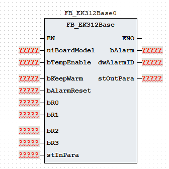
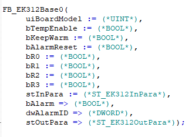

# 《FB_EK312Base 功能块使用说明》

| 项目 | 内容 |
|---|---|
| 模块名称 | `FB_EK312Base` |
| 适用场景 | 注塑机 EK312 温控模块的 12 路温区参数下发、温度采集、温区状态判断、板型配置和通信监视 |
| 版本信息 | 文档版本 1.0；库版本 1.0.0；更新日期 2026-08-18 |
| 事实原则 | 以下描述以当前 ST 执行逻辑为准；注释与实际逻辑不一致时标注“需协议确认” |

## 1. 功能概述

### 功能职责

`FB_EK312Base` 为 EK312 温控模块提供统一的数据接口，完成以下工作：

- 接收 12 路温控设定、温区功能、P/D 参数及射咀相关配置。
- 根据温控板型号生成模块输出地址 `aOutputAddr[0..99]`。
- 读取模块输入地址，输出 12 路实际温度、加热状态和版本号。
- 根据设定值、偏差参数和实际温度生成每路温区状态值。
- 监视输入地址 30 的变化，判断温控模块通信失败并输出报警。

### 输入与输出

调用者通过 `uiBoardModel`、`bTempEnable`、`bKeepWarm`、`bR0..bR3` 和 `stInPara` 提供板型、使能、保温、输出配置及模块反馈数据。功能块输出 `stOutPara`、`bAlarm` 和 `dwAlarmID`，由外部通信写入逻辑、HMI 或诊断逻辑继续使用。

### 主要流程

~~~text
循环调用
  -> 读取温控设定和模块输入地址
  -> 清零输出地址并重建温控、射咀和板型配置
  -> 复制实际温度、加热状态和版本号
  -> 判断 12 路温区状态
  -> 监视输入地址 30 的变化并更新通信报警
  -> 按复位信号清除报警输出
~~~

### 功能边界

本功能块只组织温控模块数据和诊断结果，不负责：

- EK312 通信报文的收发和物理通信接口。
- PID 闭环、加热功率调节或温控安全策略。
- 物理 I/O 访问、加热电源切断和独立安全保护。
- 射咀动作执行；本功能块只下发射咀方式、百分比和控制周期数据。

## 2. 自定义数据类型

### 2.1 `E_EK312State`

| 枚举成员 | 用途 |
|---|---|
| `eState_Idle` | 当前未使用 |
| `eState_Init` | 当前未使用 |
| `eState_Heating` | 当前未使用 |
| `eState_Error` | 当前未使用 |

### 2.2 `ST_EK312InSeg`

| 成员 | 类型 | 读写属性 | 用途 |
|---|---|---|---|
| `uiSetTemp` | `UINT` | 只读 | 温度设定值 |
| `uiMax` | `UINT` | 只读 | 温度上偏差 |
| `uiMin` | `UINT` | 只读 | 温度下偏差 |
| `uiKeepTemp` | `UINT` | 只读 | 保温设定值 |
| `uiFunc` | `UINT` | 只读 | 温区功能，`0` 为不使用 |
| `uiP` | `UINT` | 只读 | P 参数，范围 `0~300` |
| `uiD` | `UINT` | 只读 | D 参数，范围 `0~300` |

### 2.3 `ST_EK312InPara`

| 成员 | 类型 | 读写属性 | 用途 |
|---|---|---|---|
| `aSeg` | `ARRAY [0..11] OF ST_EK312InSeg` | 只读 | 12 路温控参数 |
| `aInputAddr` | `ARRAY [0..49] OF UINT` | 只读 | EK312 模块输入地址 详见第8章 |
| `uiStationNo` | `UINT` | 只读 | 站号 |
| `uiColorSelect` | `UINT` | 只读 | 色数选择 |
| `uiAColor` | `UINT` | 只读 | A 色选择 |
| `uiBColor` | `UINT` | 只读 | B 色选择 |
| `uiCColor` | `UINT` | 只读 | C 色选择 |
| `uiANozMode` | `UINT` | 只读 | A 色射咀方式，`0` 开环、`1` 闭环 |
| `uiBNozMode` | `UINT` | 只读 | B 色射咀方式 |
| `uiCNozMode` | `UINT` | 只读 | C 色射咀方式 |
| `uiANozPerc` | `UINT` | 只读 | A 色射咀百分比，范围 `0~990` |
| `uiBNozPerc` | `UINT` | 只读 | B 色射咀百分比 |
| `uiCNozPerc` | `UINT` | 只读 | C 色射咀百分比 |
| `uiContSSR` | `UINT` | 只读 | SSR 选择，`0` 接触器、`1` 固态继电器 |
| `uiNozCtrlCycle` | `UINT` | 只读 | 射咀控制周期，范围 `0~300` |

### 2.4 `ST_EK312OutSeg`

| 成员 | 类型 | 读写属性 | 用途 |
|---|---|---|---|
| `uiActualTemp` | `UINT` | 只写 | 单路实际温度 |
| `uiState` | `UINT` | 只写 | 单路温区状态 正常 `0`、偏低 `1`、偏高 `2`、断线 `3` |

### 2.5 `ST_EK312OutPara`

| 成员 | 类型 | 读写属性 | 用途 |
|---|---|---|---|
| `aSeg` | `ARRAY [0..11] OF ST_EK312OutSeg` | 只写 | 12 路温区结果 |
| `aOutputAddr` | `ARRAY [0..99] OF UINT` | 只写 | EK312 模块输出地址  详见第8章 |
| `uiHeatState` | `UINT` | 只写 | 模块加热输出状态 |
| `uiVersion` | `UINT` | 只写 | 模块版本号 |

## 3. 功能块接口

### 3.1 `VAR_IN_OUT`

无。

### 3.2 `VAR_INPUT`

| 名称 | 类型 | 当前行为 | 信号含义 |
|---|---|---|---|
| `uiBoardModel` | `UINT` | 按 `0` 或 `1` 选择输出配置 | 温控板型号 |
| `bTempEnable` | `BOOL` | 写入输出地址 16 | 温控使能 |
| `bKeepWarm` | `BOOL` | 选择地址 `0..11` 的温度来源 | 保温选择 |
| `bAlarmReset` | `BOOL` | 执行末尾清除报警输出 | 报警复位 |
| `bR0` | `BOOL` | 仅 `uiBoardModel=1` 时参与地址 25 | R0 使能 |
| `bR1` | `BOOL` | 仅 `uiBoardModel=1` 时参与地址 25 | R1 使能 |
| `bR2` | `BOOL` | 仅 `uiBoardModel=1` 时参与地址 25 | R2 使能 |
| `bR3` | `BOOL` | 仅 `uiBoardModel=1` 时参与地址 25 | R3 使能 |
| `stInPara` | `ST_EK312InPara` | 每次调用读取 | EK312 输入参数 |

### 3.3 `VAR_OUTPUT`

| 名称 | 类型 | 当前行为 | 信号含义 |
|---|---|---|---|
| `bAlarm` | `BOOL` | 通信失败时置 `TRUE`，复位时清除 | 报警状态 |
| `dwAlarmID` | `DWORD` | 报警代码按位 OR，复位时清零 | 报警代码 |
| `stOutPara` | `ST_EK312OutPara` | 每次调用重建输出数据 | EK312 输出参数 |

## 4. 报警和状态码

### 4.1 报警代码与报警信息

| 报警代码 | 报警信息 |
|---|---|
| `16#0000` | 无报警 |
| `16#0001` | 温控模块通信失败 |

### 4.2 温区状态码

| `uiState` | 含义 |
|---:|---|
| `0` | 正常或温区未启用 |
| `1` | 偏低 |
| `2` | 偏高 |
| `3` | 断线 |

## 5. 调用规范和注意事项

1. 在固定周期内调用一次；调用前刷新 `stInPara.aInputAddr[0..49]`，调用后读取并下发 `stOutPara.aOutputAddr[0..99]`。
2. `uiBoardModel` 仅使用 `0`（EK312T_R 继电器）或 `1`（EK312T_T 晶体管）；`bR0..bR3` 仅在取值 `1` 时参与地址 25。
3. `bKeepWarm=TRUE` 只改变输出地址 `0..11` 使用的设定值来源。
4. `bAlarmReset` 为电平复位，清除报警状态和报警代码，不会改变输入地址、温度结果、温区状态或输出地址重建规则；输入地址 30 持续不变时，释放复位后可能再次报警。
5. `uiMin` 和 `uiMax` 使用 `UINT` 运算，调用方应保证偏差范围合理，避免下溢或上溢造成状态误判；注释给出的 P/D 范围为 `0~300`，A 色射咀百分比范围为 `0~990`，控制周期范围为 `0~300`。
6. 本功能块只负责数据组织和诊断输出，不替代通信层、PID、加热安全保护或物理断能逻辑。

## 6. 外部交互边界

| 方向 | 交互对象 | 数据边界 |
|---|---|---|
| 输入 | HMI、配方或上层温控逻辑 | `uiBoardModel`、`bTempEnable`、`bKeepWarm`、`bR0..bR3`、`stInPara.aSeg[]` |
| 输入 | EK312 通信读取逻辑 | `stInPara.aInputAddr[0..49]` |
| 输出 | EK312 通信写入逻辑 | `stOutPara.aOutputAddr[0..99]` |
| 输出 | HMI、诊断和报警逻辑 | `stOutPara.aSeg[]`、`uiHeatState`、`uiVersion`、`bAlarm`、`dwAlarmID` |

当前功能块不直接访问 `%I/%Q`，不创建通信报文，也不调用其他轴或加热功能块。通信读写、协议转换、物理 I/O 和安全保护均由外部逻辑完成。

## 7. 最小调用示例

示例使用通用占位符，工程师需将其替换为真实对象。外部通信读取逻辑先刷新 `stInPara.aInputAddr[]`，调用功能块后再读取或下发 `stOutPara`。

~~~ST
(* 外部通信读取逻辑先刷新 stInPara.aInputAddr[]。 *)
fbExample(
  uiBoardModel := uiBoardModel,
  bTempEnable := bTempEnable,
  bKeepWarm := bKeepWarm,
  bAlarmReset := bAlarmReset,
  bR0 := bR0,
  bR1 := bR1,
  bR2 := bR2,
  bR3 := bR3,
  stInPara := stInPara,
  bAlarm => bAlarm,
  dwAlarmID => dwAlarmID,
  stOutPara => stOutPara
);

(* 外部通信写入逻辑读取 stOutPara.aOutputAddr[]；
   HMI/诊断逻辑读取 stOutPara.aSeg[]、uiHeatState、uiVersion 和报警输出。 *)
~~~

## 8. ModbusRTU 设置与物理地址映射

本章补充 ModbusRTU 通信组态、PLC 过程映像地址与 `FB_EK312Base` 数组之间的对应关系。`FB_EK312Base` 只负责组织温控参数、解析反馈和生成诊断结果，不直接创建 Modbus 报文；通信请求和物理地址由外部 ModbusRTU 层完成。

### 8.1 ModbusRTU 通信设置

当前通信接口按 Modbus RTU Client 方式使用，设置如下：

| 项目 | 设置或说明 |
|---|---|
| 通信方式 | Modbus RTU Client |
| 波特率 | `57600` |
| 校验方式 | 无校验（`none`） |
| 停止位 | 1 |
| 请求延时 | `100 ms` |
| 从站ID | 1号站  必须与 EK312 温控板实际站号一致，不能由本功能块推断 |
| 读请求 | 功能码 `03 - Read Holding Registers`；起始地址 `200`；通道数 `50`；超时 `100 ms` |
| 写请求 | 功能码 `16 - Write Multiple Registers`；起始地址 `0` ；通道数 `100`；超时 `100 ms` |

### 8.2 PLC 过程映像与功能块数组

| 数据方向 | PLC 过程映像 | 数组范围 | Modbus 寄存器索引 | 数据流向 |
|---|---|---|---|---|
| 输入 | `%IW1.1.0.200` | `gvl_TempI[0..49]` | `200..249` | 读请求 → `stInPara.aInputAddr[0..49]` |
| 输出 | `%QW1.1.1.0` | `gvl_TempQ[0..99]` | `0..99` | `stOutPara.aOutputAddr[0..99]` → 写请求 |

数组元素按 `UINT` 寄存器顺序连续对应。例如，`gvl_TempI[0]` 对应输入寄存器 `200`，`gvl_TempI[30]` 对应输入寄存器 `230`；`gvl_TempQ[0]` 对应输出寄存器 `0`，`gvl_TempQ[25]` 对应输出寄存器 `25`。

### 8.3 输入寄存器物理映射

| `stInPara.aInputAddr[]` | Modbus 寄存器索引 | 功能块使用 |
|---|---:|---|
| `[0..11]` | `200..211` | 12 路实际温度，写入 `stOutPara.aSeg[0..11].uiActualTemp` |
| `[20]` | `220` | 加热输出状态，取低 12 位写入 `stOutPara.uiHeatState` |
| `[22]` | `222` | 温控模块版本号，写入 `stOutPara.uiVersion` |
| `[30]` | `230` | 通信变化监视基准，用于判断通信失败 |

### 8.4 输出寄存器物理映射

| `stOutPara.aOutputAddr[]` | Modbus 寄存器索引 | 写入内容 |
|---|---:|---|
| `[0..11]` | `0..11` | 12 路温度设定值或保温设定值 |
| `[16]` | `16` | 温控使能 |
| `[17]` | `17` | A 色射咀方式 |
| `[22]` | `22` | A 色射咀百分比 |
| `[24]` | `24` | SSR 选择 |
| `[25]` | `25` | 温控板输出点配置字 |
| `[26]` | `26` | 射咀控制周期 |
| `[32..43]` | `32..43` | 12 路温区功能 |
| `[48..59]` | `48..59` | 12 路 P 参数 |
| `[64..75]` | `64..75` | 12 路 D 参数 |
| `[80]` | `80` | 固定写入 `0`，色数选择 |
| `[81..83]` | `81..83` | 固定写入 `255`，A/B/C 色选择 |
| `[84..87]` | `84..87` | 固定写入 `0`，B/C 射咀方式和百分比 |

### 8.5 工程师核对顺序

1. 先确认 ModbusRTU 的串口、波特率、校验、停止位、请求延时和温控板从站地址。
2. 确认读请求为功能码 `03`、起始索引 `200`、数量 `50`，并将输入寄存器读入 `stInPara.aInputAddr[0..49]`。
3. 调用 `FB_EK312Base`，由功能块重建 `stOutPara.aOutputAddr[0..99]`。
4. 确认写请求为功能码 `16`、数量 `100`；当前写区按输出索引 `0` 起始映射，若组态界面显式填写 `Start_Address`，应与该映射一致。
5. 调试时优先核对寄存器索引与数组下标的偏移关系，不能把输入起始索引 `200` 误用于输出区。
