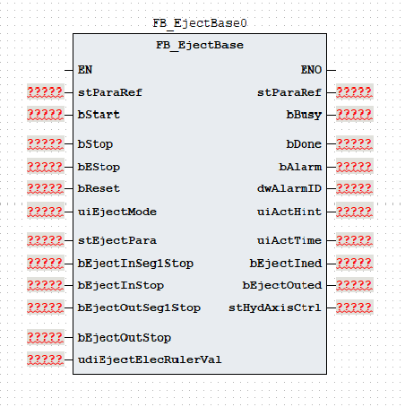
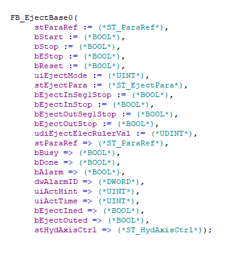

# 《FB_EjectBase 功能块使用说明》

| 项目 | 内容 |
|---|---|
| 模块名称 | `FB_EjectBase` |
| 适用场景 | 注塑机托模进、托模保持和托模退的多段工艺控制 |
| 版本信息 | 文档版本 1.0；库版本 1.0.0；更新日期 2026-08-20 |
| 事实原则 | 以下描述以当前 ST 执行逻辑为准；注释与实际逻辑不一致时标注“需协议确认” |

## 1. 功能概述

### 功能职责

`FB_EjectBase` 组织托模进、托模保持和托模退的启动、分段执行、结束、完成及错误流程，将托模工艺参数和停止/电子尺反馈转换为 `stHydAxisCtrl` 轴命令，并输出动作状态、完成状态和报警结果。功能块支持：

- 托模进和托模退；
- 普通模式和调模模式下的托模进、托模退；
- 托模进最多 3 段、托模退最多 3 段；
- 托模进完成后的保持阶段；
- 时间、数字停止反馈或电子尺位置三种分段结束方式；
- 位置模式、速度模式和保持阶段的轴控制命令；
- 托模进完成、托模退完成、保持状态、动作提示、报警状态和报警代码输出。

### 输入与输出

| 调用者提供 | 功能块输出 |
|---|---|
| `bStart`、`bStop`、`bEStop`、`bReset`、`uiEjectMode` | `bBusy`、`bDone`、`bAlarm`、`dwAlarmID` |
| `stEjectPara` | `uiActHint`、`uiActTime`、`bEjectIned`、`bEjectOuted` |
| `stHydAxisRef`、`stParaRef`、托模进/退停止反馈、`udiEjectElecRulerVal` | `stHydAxisCtrl` 轴命令和轴状态包；`stHydAxisRef` 调用后回写 |

### 主要执行流程

~~~text
根据 uiEjectMode 派生普通/调模及托模进/退请求
  -> 按优先级处理复位、急停和正常停止
  -> Idle 接收 bStart 上升沿后进入 Init
  -> Init 将输入段数换算为内部最后下标并设置轴方向
  -> 托模进请求：EjectIning[0..2] -> EjectIned
       -> 普通模式保持时间有效：EjectKeeping -> EjectKept
       -> 调模模式或保持时间为 0：直接进入 EjectKept
  -> 托模退请求：EjectOuting[0..2] -> EjectOuted
  -> 模式无效或托模进/退总限时到 -> Error
  -> 内部调用 FB_HydAxis，回写 stHydAxisRef 并转存轴命令和轴状态到 stHydAxisCtrl
~~~

### 功能边界

本功能块生成托模工艺阶段和轴命令，并在当前 ST 的固定 `IF TRUE` 分支内调用 `FB_HydAxis`；不访问通信报文、全局变量、`%I/%Q` 或物理 I/O，也不实现轴闭环、独立急停、安全联锁、机械限位、电子尺合理性检查、轴故障处理或物理能量切断。`FB_EleAxis` 分支虽然保留在 ST 中，但当前 `IF TRUE` 条件下不会执行；电动轴切换需先修改并核对实际 POU 实现。

## 2. 自定义数据类型

### 2.1 `E_EjectState`

| 枚举成员 | 用途 |
|---|---|
| `eEjectState_Idle` | 空闲 |
| `eEjectState_Init` | 初始化 |
| `eEjectState_EjectIning` | 托模进 |
| `eEjectState_EjectIned` | 托模进完成 |
| `eEjectState_EjectKeeping` | 托模保持 |
| `eEjectState_EjectKept` | 托模保持完成 |
| `eEjectState_EjectOuting` | 托模退 |
| `eEjectState_EjectOuted` | 托模退完成 |
| `eEjectState_Error` | 错误 |

### 2.2 `ST_EjectSeg`

| 成员 | 类型 | 读写属性 | 用途 |
|---|---|---|---|
| `uiPres` | `UINT` | 只读 | 压力命令 |
| `uiSpd` | `UINT` | 只读 | 速度命令 |
| `udiPos` | `UDINT` | 只读 | 位置目标 |
| `uiTime` | `UINT` | 只读 | 时间阈值 |
| `uiPresGrad` | `UINT` | 只读 | 压力斜率 |
| `uiSpdGrad` | `UINT` | 只读 | 速度斜率 |

### 2.3 `ST_EjectPara`

| 成员 | 类型 | 读写属性 | 用途 |
|---|---|---|---|
| `uiEjectInSegCnt` | `UINT` | 只读 | 托模进段数选择；收口到 `0..2` |
| `uiEjectInMode` | `UINT` | 只读 | 托模进方式：`0` 时间、`1` 行程、`2` 位置 |
| `uiEjectInLimitTime` | `UINT` | 只读 | 托模进总限时 |
| `aEjectInSeg` | `ARRAY[0..2] OF ST_EjectSeg` | 只读 | 托模进分段参数 |
| `stEjectInDebug` | `ST_EjectSeg` | 只读 | 托模进调模参数 |
| `uiEjectInDebugPresStartGrad` | `UINT` | 只读 | 托模进调模压力启动斜率 |
| `uiEjectInDebugPresStopGrad` | `UINT` | 只读 | 托模进调模压力停止斜率 |
| `uiEjectInDebugSpdStartGrad` | `UINT` | 只读 | 托模进调模速度启动斜率 |
| `uiEjectInDebugSpdStopGrad` | `UINT` | 只读 | 托模进调模速度停止斜率 |
| `uiEjectInPresStartGrad` | `UINT` | 只读 | 托模进压力启动斜率 |
| `uiEjectInPresStopGrad` | `UINT` | 只读 | 托模进压力停止斜率 |
| `uiEjectInSpdStartGrad` | `UINT` | 只读 | 托模进速度启动斜率 |
| `uiEjectInSpdStopGrad` | `UINT` | 只读 | 托模进速度停止斜率 |
| `stEjectKeepSeg` | `ST_EjectSeg` | 只读 | 托模保持参数 |
| `stEjectKeepDebug` | `ST_EjectSeg` | 只读 | 托模保持调模参数 |
| `uiEjectOutSegCnt` | `UINT` | 只读 | 托模退段数选择；收口到 `0..2` |
| `uiEjectOutMode` | `UINT` | 只读 | 托模退方式：`0` 时间、`1` 行程、`2` 位置 |
| `uiEjectOutLimitTime` | `UINT` | 只读 | 托模退总限时 |
| `aEjectOutSeg` | `ARRAY[0..2] OF ST_EjectSeg` | 只读 | 托模退分段参数 |
| `stEjectOutDebug` | `ST_EjectSeg` | 只读 | 托模退调模参数 |
| `uiEjectOutDebugPresStartGrad` | `UINT` | 只读 | 托模退调模压力启动斜率 |
| `uiEjectOutDebugPresStopGrad` | `UINT` | 只读 | 托模退调模压力停止斜率 |
| `uiEjectOutDebugSpdStartGrad` | `UINT` | 只读 | 托模退调模速度启动斜率 |
| `uiEjectOutDebugSpdStopGrad` | `UINT` | 只读 | 托模退调模速度停止斜率 |
| `uiEjectOutPresStartGrad` | `UINT` | 只读 | 托模退压力启动斜率 |
| `uiEjectOutPresStopGrad` | `UINT` | 只读 | 托模退压力停止斜率 |
| `uiEjectOutSpdStartGrad` | `UINT` | 只读 | 托模退速度启动斜率 |
| `uiEjectOutSpdStopGrad` | `UINT` | 只读 | 托模退速度停止斜率 |

### 2.4 `ST_ParaRef`

| 成员 | 类型 | 读写属性 | 用途 |
|---|---|---|---|
| `udiPosToleranceValue` | `UDINT` | 读写 | 位置容差值 |

### 2.5 `ST_HydAxisRef`

该类型由液压轴库定义。`FB_EjectBase` 将其传入内部 `FB_HydAxis`，调用后再回写；结构成员请查阅 HydTechnology 技术库使用说明书。

### 2.6 `ST_HydAxisCtrl`

| 成员 | 类型 | 读写属性 | 用途 |
|---|---|---|---|
| `bAxisStart` | `BOOL` | 只写 | 轴启动窗口 |
| `uiAxisDir` | `UINT` | 只写 | 轴方向值；托模进写 `2`、托模退写 `1` |
| `uiAxisMode` | `UINT` | 只写 | 轴控制模式：`1` 位置、`2` 速度、`3` 压力 |
| `uiPresCmd` | `UINT` | 只写 | 压力命令 |
| `uiSpdCmd` | `UINT` | 只写 | 速度命令 |
| `uiEndSpdCmd` | `UINT` | 只写 | 段结束速度 |
| `udiPosCmd` | `UDINT` | 只写 | 位置命令 |
| `uiAxisPresAcc` | `UINT` | 只写 | 压力加速度参数 |
| `uiAxisPresDec` | `UINT` | 只写 | 压力减速度参数 |
| `uiAxisSpdAcc` | `UINT` | 只写 | 速度加速度参数 |
| `uiAxisSpdDec` | `UINT` | 只写 | 速度减速度参数 |
| `uiAxisJerk` | `UINT` | 只写 | 加加速度参数 |
| `bBusy` | `BOOL` | 内部轴功能块写入 | 液压轴忙状态 |
| `bDone` | `BOOL` | 内部轴功能块写入 | 液压轴完成状态 |
| `bInVelocity` | `BOOL` | 内部轴功能块写入 | 液压轴速度到位状态 |
| `bInPressure` | `BOOL` | 内部轴功能块写入 | 液压轴压力到位状态 |
| `bAlarm` | `BOOL` | 内部轴功能块写入 | 液压轴报警状态 |
| `dwAlarmID` | `DWORD` | 内部轴功能块写入 | 液压轴报警代码 |

## 3. 功能块接口

### 3.1 `VAR_IN_OUT`

| 名称 | 类型 | 当前行为 | 信号含义 |
|---|---|---|---|
| `stHydAxisRef` | `ST_HydAxisRef` | 传入内部 `FB_HydAxis`，调用后回写 | 液压轴参数引用参考 |
| `stParaRef` | `ST_ParaRef` | 引用位置容差值 | 工艺参数引用参考 |

### 3.2 `VAR_INPUT`

| 名称 | 类型 | 当前行为 | 信号含义 |
|---|---|---|---|
| `bStart` | `BOOL` | 在 `Idle` 状态检测上升沿后进入初始化 | 启动命令 |
| `bStop` | `BOOL` | 与启动下降沿共同触发正常停止；回到空闲并清主要轴命令 | 正常停止 |
| `bEStop` | `BOOL` | 进入错误状态并置 `16#0001` | 急停命令 |
| `bReset` | `BOOL` | 最高优先级；清状态、报警、主要轴命令和计时 | 复位命令 |
| `uiEjectMode` | `UINT` | `1/2` 为普通托模进/退，`3/4` 为调模托模进/退；其他值（含 `0`）无效 | 托模动作模式 |
| `stEjectPara` | `ST_EjectPara` | 动作过程中按周期读取 | 托模工艺参数 |
| `bEjectInSeg1Stop` | `BOOL` | 托模进第一段且结束方式为 `1` 时参与结束判断 | 托模进第一段停止反馈 |
| `bEjectInStop` | `BOOL` | 托模进后续段且结束方式为 `1` 时参与结束判断 | 托模进停止反馈 |
| `bEjectOutSeg1Stop` | `BOOL` | 托模退第一段且结束方式为 `1` 时参与结束判断 | 托模退第一段停止反馈 |
| `bEjectOutStop` | `BOOL` | 托模退后续段且结束方式为 `1` 时参与结束判断 | 托模退停止反馈 |
| `udiEjectElecRulerVal` | `UDINT` | 结束方式为 `2` 时参与位置比较 | 托模电子尺值 |

### 3.3 `VAR_OUTPUT`

| 名称 | 类型 | 当前行为 | 信号含义 |
|---|---|---|---|
| `bBusy` | `BOOL` | 启动后置位；托模进完成后及停止、保持完成、托模退完成、急停或错误时清除 | 工艺忙状态 |
| `bDone` | `BOOL` | 保持完成或托模退完成状态置位；`Idle` 或复位清除 | 完成状态 |
| `bAlarm` | `BOOL` | 无效模式、急停或错误状态置位；复位清除 | 报警状态 |
| `dwAlarmID` | `DWORD` | 报警代码按位 OR 保持；复位清零 | 报警代码 |
| `uiActHint` | `UINT` | 输出空闲、错误、托模进分段、保持或托模退分段提示 | 动作提示 |
| `uiActTime` | `UINT` | 输出托模进/保持/托模退当前阶段累计调用值 | 动作时间 |
| `bEjectIned` | `BOOL` | 托模保持完成时置位；`Idle` 或复位清除 | 托模进完成 |
| `bEjectOuted` | `BOOL` | 托模退完成时置位；`Idle` 或复位清除 | 托模退完成 |
| `stHydAxisCtrl` | `ST_HydAxisCtrl` | 调用末尾转存当前周期轴命令和内部 `FB_HydAxis` 状态 | 轴命令和轴状态包 |

`stHydAxisCtrl.bBusy`、`bDone`、`bInVelocity`、`bInPressure`、`bAlarm` 和 `dwAlarmID` 来自内部 `FB_HydAxis`，与功能块本身的 `bBusy`、`bDone`、`bAlarm` 和 `dwAlarmID` 分属不同层级。工艺功能块报警代码和轴报警代码应分别读取，不应直接互换。

## 4. 报警和状态码

### 4.1 报警代码与报警信息

| 报警代码 | 报警信息 |
|---|---|
| `16#0000` | 无报警 |
| `16#0001` | 紧急停止 |
| `16#0002` | `uiEjectMode` 参数无效 |
| `16#0004` | 托模进限时报警 |
| `16#0008` | 托模退限时报警 |

### 4.2 动作状态码

| `uiActHint` | 含义 |
|---:|---|
| `0` | 空闲 |
| `1` | 报警状态 |
| `2` | 托模进完成 |
| `3` | 托模退完成 |
| `4` | 托模保持或保持完成 |
| `11..13` | 托模进第 1～3 段 |
| `21..23` | 托模退第 1～3 段 |

## 5. 调用规范和注意事项

1. 在固定周期内每周期调用一次。托模进/退分段和托模保持每次活动调用将阶段计时和总计时各增加 `1`；分段时间和保持时间使用 `uiTime×100` 次调用比较，托模进/退总限时使用对应 `uiEject*LimitTime×100` 次调用比较。实际时间由任务调用周期决定，`uiActTime` 是当前阶段累计调用值而非独立系统时钟。
2. 调用顺序应为：先刷新 `stHydAxisRef`、托模进/退停止反馈、电子尺值、`uiEjectMode` 和 `stEjectPara`，再调用 `FB_EjectBase`，最后读取 `stHydAxisCtrl`、回写后的 `stHydAxisRef`、动作状态、完成状态和两层报警。轴功能块已在当前 POU 内部调用，调用者不应重复调用外部轴功能块。
3. `uiEjectMode` 只允许 `1` 普通托模进、`2` 普通托模退、`3` 调模托模进或 `4` 调模托模退；其他值（含 `0`）在 `Init` 产生 `16#0002`。`uiEjectInSegCnt` 和 `uiEjectOutSegCnt` 是段数选择而不是最后下标：输入 `1..3` 分别换算为内部最后下标 `0..2`，大于 `3` 收口到 `2`，输入 `0` 仍会执行第 1 段。`uiEjectInMode`、`uiEjectOutMode` 应限定为 `0`、`1` 或 `2`；其他值没有独立报警，可能无法满足结束条件。调模分段的结束条件仍读取普通分段数组，`stEjectKeepDebug` 当前因调模流程跳过保持阶段而未读取；`stParaRef.udiPosToleranceValue` 也未读取。压力、速度、位置、时间、斜率、方向编码和电子尺单位需按受控轴协议确认。
4. `bReset`、`bEStop`、`bStop` 和状态机的处理优先级为 `bReset` > `bEStop` > `bStop`/`bStart` 下降沿 > 状态机。`bStart` 仅在 `Idle` 状态的上升沿启动；正常停止回到 `Idle` 并清主要轴命令，完成状态在完成分支保持，下一次动作前应通过停止或复位回到 `Idle`。复位优先级高于急停，但急停保持有效时复位后会再次进入错误状态。
5. `bBusy` 是工艺忙状态，`stHydAxisCtrl.bAxisStart` 是阶段启动窗口，`stHydAxisCtrl.uiAxisMode` 是轴命令模式，`stHydAxisCtrl.bBusy` 是内部液压轴忙状态，四者不可互相替代。托模进/退位置方式分别生成 `uiAxisMode=1`，时间/行程方式生成 `uiAxisMode=2`，保持阶段生成 `uiAxisMode=3`；托模进/退阶段在累计计时小于 `20` 次调用时将 `bAxisStart` 置位，保持阶段在保持计时未到时持续置位。斜率字段中，`uiAxisPresAcc`/`uiAxisPresDec` 只转存到 `stHydAxisCtrl`，内部 `FB_HydAxis` 当前接收速度加减速和 `uiAxisJerk`，其中 `uiAxisJerk` 没有可靠赋值来源；停止、保持完成、托模退完成、急停、错误和空闲分支清主要轴命令，托模进阶段完成分支的主要轴命令清零语句当前未执行；部分斜率字段可能保留上次值，不应在 `uiAxisMode=0` 时视为有效执行命令。
6. 当前固定 `IF TRUE` 分支每周期执行内部 `FB_HydAxis`，`FB_EleAxis` 分支不会执行；托模进方向写 `2`、托模退方向写 `1`。功能块报警与轴报警按两层分别读取和汇总；当前停止反馈异常、电子尺异常、保持参数异常和轴反馈异常未映射为其他功能块报警。本功能块不替代独立急停、安全门/光幕、托模互锁、机械限位、轴故障处理或物理能量切断。

## 6. 外部交互边界

| 方向 | 交互对象 | 数据边界 |
|---|---|---|
| 输入 | HMI/配方/上层工艺逻辑 | `uiEjectMode`、`stEjectPara`、`bStart`、`bStop`、`bEStop`、`bReset` |
| 输入 | 现场信号转换层 | `bEjectInSeg1Stop`、`bEjectInStop`、`bEjectOutSeg1Stop`、`bEjectOutStop`、`udiEjectElecRulerVal` |
| 输入/输出 | `stHydAxisRef` | 传入内部 `FB_HydAxis`，调用后回写液压轴配置和反馈结构 |
| 输入 | 其他上层接口 | `stParaRef`；当前声明但未被本功能块读取 |
| 内部调用 | `FB_HydAxis` | 接收本功能块生成的启动/停止/急停/复位、方向、模式、压力、速度、结束速度、位置和速度加减速/加加速度命令，并将轴状态和轴报警转存到 `stHydAxisCtrl` |
| 预留分支 | `FB_EleAxis` | 当前固定 `IF TRUE` 分支不会执行；切换电动轴前需修改并核对实际接口 |
| 输出 | HMI/诊断/报警逻辑 | `bBusy`、`bDone`、`bAlarm`、`dwAlarmID`、`uiActHint`、`uiActTime`、`bEjectIned`、`bEjectOuted` 和轴报警 |

当前 ST 不直接访问通信报文、全局变量或 `%I/%Q`；轴功能块由本功能块内部调用。工艺功能块报警和轴层报警仍是两层输出，外部逻辑按系统报警策略分别读取并汇总。

## 7. 最小调用示例

### 7.1 内部调用轴功能块的功能块

以下示例使用通用占位符，工程师需将其替换为实际对象。上层逻辑先准备 `stHydAxisRef`、`uiEjectMode`、`stEjectPara` 和托模反馈，再调用本功能块。当前 `FB_EjectBase` ST 已在内部调用 `FB_HydAxis`，示例不再重复调用外部轴功能块；`stHydAxisCtrl` 同时提供轴命令和轴状态，`bAlarmAll` 用于汇总工艺功能块和轴报警状态。

~~~ST
(* 上层动作逻辑先生成 bStart、uiEjectMode、stEjectPara 和托模反馈。 *)

(* 调用托模工艺功能块；停止、急停和复位信号由上层逻辑提供。 *)
fbExample(
  stHydAxisRef := stHydAxisRef,
  stParaRef := stParaRef,
  bStart := bStart,
  bStop := bStop,
  bEStop := bEStop,
  bReset := bReset,
  uiEjectMode := uiEjectMode,
  stEjectPara := stEjectPara,
  bEjectInSeg1Stop := bEjectInSeg1Stop,
  bEjectInStop := bEjectInStop,
  bEjectOutSeg1Stop := bEjectOutSeg1Stop,
  bEjectOutStop := bEjectOutStop,
  udiEjectElecRulerVal := udiEjectElecRulerVal,
  bBusy => bBusy,
  bDone => bDone,
  bAlarm => bProcessAlarm,
  dwAlarmID => dwEjectAlarmID,
  uiActHint => uiActHint,
  uiActTime => uiActTime,
  bEjectIned => bEjectIned,
  bEjectOuted => bEjectOuted,
  stHydAxisCtrl => stHydAxisCtrl
);

(* 轴命令和轴状态已由 FB_EjectBase 内部处理；外部按需要汇总两层报警。 *)
bAlarmAll := bProcessAlarm OR stHydAxisCtrl.bAlarm;
dwAxisAlarmID := stHydAxisCtrl.dwAlarmID;
~~~
