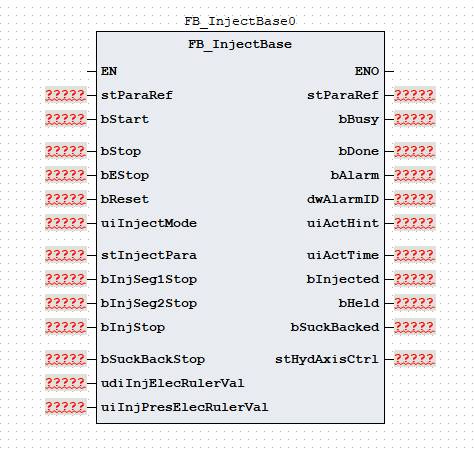
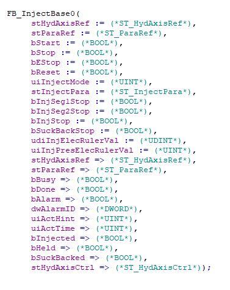

# 《FB_InjectBase 功能块使用说明》

| 项目 | 内容 |
|---|---|
| 模块名称 | `FB_InjectBase` |
| 适用场景 | 注塑机射出、保压和射退的多段工艺控制 |
| 版本信息 | 文档版本 1.0；库版本 1.0.0；更新日期 2026-08-20 |
| 事实原则 | 以下描述以当前 ST 执行逻辑为准；注释与实际逻辑不一致时标注“需协议确认” |

## 1. 功能概述

### 功能职责

`FB_InjectBase` 组织射出、保压和射退的启动、分段执行、转段、完成及错误流程，将射胶工艺参数、电子尺/压力反馈和停止信号转换为 `stHydAxisCtrl` 轴命令，并输出动作状态、完成状态和报警结果。功能块支持：

- 射出最多 10 段，保压最多 8 段；
- 射出过程中按位置、总时间、压力或时间模式下全部分段结束转入保压；
- 保压按段时间执行，保压阶段不输出位置命令；
- 射退单段按电子尺位置或时间结束；时间模式额外读取停止信号，但时间为 `0` 时已先满足时间条件并立即结束；
- 位置模式、速度模式和保压压力模式的轴控制命令；
- 射出完成、保压完成、射退完成、动作提示、报警状态和报警代码输出。

### 输入与输出

| 调用者提供 | 功能块输出 |
|---|---|
| `bStart`、`bStop`、`bEStop`、`bReset`、`uiInjectMode` | `bBusy`、`bDone`、`bAlarm`、`dwAlarmID` |
| `stInjectPara`、`stParaRef` | `uiActHint`、`uiActTime`、`bInjected`、`bHeld`、`bSuckBacked` |
| `stHydAxisRef`、射出/射退停止信号、电子尺位置和压力反馈 | `stHydAxisCtrl` 轴命令和轴状态包；`stHydAxisRef` 调用后回写 |

### 主要执行流程

~~~text
根据 uiInjectMode 派生普通/调模及射出/射退请求
  -> 按优先级处理复位、急停和正常停止
  -> Idle 接收 bStart 上升沿后进入 Init
  -> 射出请求：Injecting[0..9] -> Injected
       -> 保压段数大于 0：Holding[0..7] -> Held
       -> 保压段数为 0：直接进入 Held
  -> 射退请求：SuckBacking -> SuckBacked
  -> 模式无效或射出/射退总限时到 -> Error
  -> 内部调用 FB_HydAxis，回写 stHydAxisRef 并转存轴命令和轴状态到 stHydAxisCtrl
~~~

### 功能边界

本功能块生成射出、保压和射退工艺状态及轴命令，并在当前 ST 的固定 `IF TRUE` 分支内调用 `FB_HydAxis`；不访问通信报文、全局变量、`%I/%Q` 或物理 I/O，也不实现轴闭环、独立急停、压力上限保护、电子尺合理性检查、模具/射胶安全联锁、轴故障处理或物理能量切断。`FB_EleAxis` 分支虽然保留在 ST 中，但当前 `IF TRUE` 条件下不会执行；电动轴切换需先修改并核对实际 POU 实现。

## 2. 自定义数据类型

### 2.1 `E_InjectState`

| 枚举成员 | 用途 |
|---|---|
| `eInjectState_Idle` | 空闲 |
| `eInjectState_Init` | 初始化 |
| `eInjectState_Injecting` | 射出 |
| `eInjectState_Injected` | 射出完成 |
| `eInjectState_Holding` | 保压 |
| `eInjectState_Held` | 保压完成 |
| `eInjectState_SuckBacking` | 射退 |
| `eInjectState_SuckBacked` | 射退完成 |
| `eInjectState_Error` | 错误 |

### 2.2 `ST_InjectSeg`

| 成员 | 类型 | 读写属性 | 用途 |
|---|---|---|---|
| `uiPres` | `UINT` | 只读 | 压力命令 |
| `uiSpd` | `UINT` | 只读 | 速度命令 |
| `udiPos` | `UDINT` | 只读 | 位置目标 |
| `uiTime` | `UINT` | 只读 | 时间阈值 |
| `uiPresGrad` | `UINT` | 只读 | 压力斜率 |
| `uiSpdGrad` | `UINT` | 只读 | 速度斜率 |

### 2.3 `ST_HoldSeg`

| 成员 | 类型 | 读写属性 | 用途 |
|---|---|---|---|
| `uiPres` | `UINT` | 只读 | 保压压力命令 |
| `uiSpd` | `UINT` | 只读 | 保压速度命令 |
| `uiTime` | `UINT` | 只读 | 保压时间阈值 |
| `uiPresGrad` | `UINT` | 只读 | 压力斜率 |
| `uiSpdGrad` | `UINT` | 只读 | 速度斜率 |

### 2.4 `ST_InjectPara`

| 成员 | 类型 | 读写属性 | 用途 |
|---|---|---|---|
| `uiInjSegCnt` | `UINT` | 只读 | 射出段数选择；收口到 `0..9` |
| `uiInjMode` | `UINT` | 只读 | 射出方式：`0` 位置、`1` 行程、`2` 时间 |
| `uiInjLimitTime` | `UINT` | 只读 | 射出总限时 |
| `uiInjTotalTime` | `UINT` | 只读 | 射出总时间 |
| `uiInjToHoldMode` | `UINT` | 只读 | 转保压方式：`0` 位置、`1` 时间、`2` 压力 |
| `uiInjToHoldPres` | `UINT` | 只读 | 转保压压力 |
| `udiInjToHoldPos` | `UDINT` | 只读 | 转保压位置 |
| `aInjSeg` | `ARRAY[0..9] OF ST_InjectSeg` | 只读 | 射出分段参数 |
| `stInjDebug` | `ST_InjectSeg` | 只读 | 射出调模参数 |
| `uiInjDebugPresStartGrad` | `UINT` | 只读 | 射出调模压力启动斜率 |
| `uiInjDebugPresStopGrad` | `UINT` | 只读 | 射出调模压力停止斜率 |
| `uiInjDebugSpdStartGrad` | `UINT` | 只读 | 射出调模速度启动斜率 |
| `uiInjDebugSpdStopGrad` | `UINT` | 只读 | 射出调模速度停止斜率 |
| `uiInjPresStartGrad` | `UINT` | 只读 | 射出首段压力启动斜率 |
| `uiInjPresStopGrad` | `UINT` | 只读 | 射出压力停止斜率 |
| `uiInjSpdStartGrad` | `UINT` | 只读 | 射出首段速度启动斜率 |
| `uiInjSpdStopGrad` | `UINT` | 只读 | 射出速度停止斜率 |
| `uiHoldSegCnt` | `UINT` | 只读 | 保压段数选择；收口到 `0..7` |
| `aHoldSeg` | `ARRAY[0..7] OF ST_HoldSeg` | 只读 | 保压分段参数 |
| `stHoldDebug` | `ST_HoldSeg` | 只读 | 保压调模参数 |
| `uiSuckBackMode` | `UINT` | 只读 | 射退方式：`0` 位置、`1` 行程 |
| `uiSuckBackLimitTime` | `UINT` | 只读 | 射退总限时 |
| `stSuckBackSeg` | `ST_InjectSeg` | 只读 | 射退单段参数 |
| `stSuckBackDebug` | `ST_InjectSeg` | 只读 | 射退调模参数 |
| `uiSuckBackDebugPresStartGrad` | `UINT` | 只读 | 射退调模压力启动斜率 |
| `uiSuckBackDebugPresStopGrad` | `UINT` | 只读 | 射退调模压力停止斜率 |
| `uiSuckBackDebugSpdStartGrad` | `UINT` | 只读 | 射退调模速度启动斜率 |
| `uiSuckBackDebugSpdStopGrad` | `UINT` | 只读 | 射退调模速度停止斜率 |
| `uiSuckBackPresStartGrad` | `UINT` | 只读 | 射退压力启动斜率 |
| `uiSuckBackPresStopGrad` | `UINT` | 只读 | 射退压力停止斜率 |
| `uiSuckBackSpdStartGrad` | `UINT` | 只读 | 射退速度启动斜率 |
| `uiSuckBackSpdStopGrad` | `UINT` | 只读 | 射退速度停止斜率 |

### 2.5 `ST_ParaRef`

| 成员 | 类型 | 读写属性 | 用途 |
|---|---|---|---|
| `udiPosToleranceValue` | `UDINT` | 读写 | 位置容差值 |

### 2.6 `ST_HydAxisRef`

该类型由液压轴库定义。`FB_InjectBase` 将其传入内部 `FB_HydAxis`，调用后再回写；结构成员请查阅 HydTechnology 技术库使用说明书。

### 2.7 `ST_HydAxisCtrl`

| 成员 | 类型 | 读写属性 | 用途 |
|---|---|---|---|
| `bAxisStart` | `BOOL` | 只写 | 轴启动信号 |
| `uiAxisDir` | `UINT` | 只写 | 轴方向值；射出写 `2`、射退写 `1` |
| `uiAxisMode` | `UINT` | 只写 | 轴控制模式：`1` 位置、`2` 速度、`3` 压力 |
| `uiPresCmd` | `UINT` | 只写 | 压力命令 |
| `uiSpdCmd` | `UINT` | 只写 | 速度命令 |
| `uiEndSpdCmd` | `UINT` | 只写 | 段结束速度 |
| `udiPosCmd` | `UDINT` | 只写 | 位置命令 |
| `uiAxisPresAcc` | `UINT` | 只写 | 压力加速度参数 |
| `uiAxisPresDec` | `UINT` | 只写 | 压力减速度参数 |
| `uiAxisSpdAcc` | `UINT` | 只写 | 速度加速度参数 |
| `uiAxisSpdDec` | `UINT` | 只写 | 速度减速度参数 |
| `uiAxisJerk` | `UINT` | 只写 | 加加速度参数 |
| `bBusy` | `BOOL` | 内部轴功能块写入 | 液压轴忙状态 |
| `bDone` | `BOOL` | 内部轴功能块写入 | 液压轴完成状态 |
| `bInVelocity` | `BOOL` | 内部轴功能块写入 | 液压轴速度到位状态 |
| `bInPressure` | `BOOL` | 内部轴功能块写入 | 液压轴压力到位状态 |
| `bAlarm` | `BOOL` | 内部轴功能块写入 | 液压轴报警状态 |
| `dwAlarmID` | `DWORD` | 内部轴功能块写入 | 液压轴报警代码 |

## 3. 功能块接口

### 3.1 `VAR_IN_OUT`

| 名称 | 类型 | 当前行为 | 信号含义 |
|---|---|---|---|
| `stHydAxisRef` | `ST_HydAxisRef` | 传入内部 `FB_HydAxis`，调用后回写 | 液压轴参数引用参考 |
| `stParaRef` | `ST_ParaRef` | 引用位置容差值 | 工艺参数引用参考 |

### 3.2 `VAR_INPUT`

| 名称 | 类型 | 当前行为 | 信号含义 |
|---|---|---|---|
| `bStart` | `BOOL` | 在 `Idle` 状态检测上升沿后进入初始化 | 启动命令 |
| `bStop` | `BOOL` | 与启动下降沿共同触发正常停止；回到空闲并清主要轴命令 | 正常停止 |
| `bEStop` | `BOOL` | 进入错误状态并置 `16#0001` | 急停命令 |
| `bReset` | `BOOL` | 最高优先级；清状态、报警、主要轴命令和计时 | 复位命令 |
| `uiInjectMode` | `UINT` | `1/2` 为普通射出/射退，`3/4` 为调模射出/射退；其他值（含 `0`）无效 | 射胶动作模式 |
| `stInjectPara` | `ST_InjectPara` | 动作过程中按周期读取 | 射胶工艺参数 |
| `bInjSeg1Stop` | `BOOL` | 射出结束方式为 `1` 且当前为第 0 段时参与结束判断 | 射出第 1 段停止反馈 |
| `bInjSeg2Stop` | `BOOL` | 射出结束方式为 `1` 且当前为第 1 段时参与结束判断 | 射出第 2 段停止反馈 |
| `bInjStop` | `BOOL` | 射出结束方式为 `1` 时参与所有射出段结束判断 | 射出停止反馈 |
| `bSuckBackStop` | `BOOL` | 仅在射退结束方式为 `1` 且单段时间为 `0` 时参与附加判断 | 射退停止反馈 |
| `udiInjElecRulerVal` | `UDINT` | 参与射出分段、转保压和射退电子尺比较 | 射胶电子尺值 |
| `uiInjPresElecRulerVal` | `UINT` | `uiInjToHoldMode=2` 时参与转保压压力比较 | 射胶压力值 |

### 3.3 `VAR_OUTPUT`

| 名称 | 类型 | 当前行为 | 信号含义 |
|---|---|---|---|
| `bBusy` | `BOOL` | 启动后置位并保持至保压完成或射退完成；停止、急停或错误时清除 | 工艺忙状态 |
| `bDone` | `BOOL` | `Held` 或 `SuckBacked` 状态置位；`Idle` 或复位清除 | 完成状态 |
| `bAlarm` | `BOOL` | 无效模式、急停或错误状态置位；复位清除 | 报警状态 |
| `dwAlarmID` | `DWORD` | 报警代码按位 OR 保持；复位清零 | 报警代码 |
| `uiActHint` | `UINT` | 输出空闲、错误、射出分段、保压分段、射退或完成提示 | 动作提示 |
| `uiActTime` | `UINT` | 输出射出、保压或射退当前阶段累计调用值 | 动作时间 |
| `bInjected` | `BOOL` | 进入 `Injected` 状态后置位；`Idle` 或复位清除 | 射出完成 |
| `bHeld` | `BOOL` | 保压段结束进入 `Held` 时置位；无保压时也在 `Held` 状态置位 | 保压完成 |
| `bSuckBacked` | `BOOL` | 进入 `SuckBacked` 状态后置位；`Idle` 或复位清除 | 射退完成 |
| `stHydAxisCtrl` | `ST_HydAxisCtrl` | 调用末尾转存当前周期轴命令和内部 `FB_HydAxis` 状态 | 轴命令和轴状态包 |

`stHydAxisCtrl.bBusy`、`bDone`、`bInVelocity`、`bInPressure`、`bAlarm` 和 `dwAlarmID` 来自内部 `FB_HydAxis`，与功能块本身的 `bBusy`、`bDone`、`bAlarm` 和 `dwAlarmID` 分属不同层级。工艺功能块报警代码和轴报警代码应分别读取，不应直接互换。

## 4. 报警和状态码

### 4.1 报警代码与报警信息

| 报警代码 | 报警信息 |
|---|---|
| `16#0000` | 无报警 |
| `16#0001` | 紧急停止 |
| `16#0002` | `uiInjectMode` 参数无效 |
| `16#0004` | 射出限时报警 |
| `16#0008` | 射退限时报警 |

### 4.2 动作状态码

| `uiActHint` | 含义 |
|---:|---|
| `0` | 空闲 |
| `1` | 报警状态 |
| `2` | 射出完成 |
| `3` | 保压完成 |
| `4` | 射退完成 |
| `5` | 射退中 |
| `11..20` | 射出第 1～10 段 |
| `21..28` | 保压第 1～8 段 |

## 5. 调用规范和注意事项

1. 在固定周期内每周期调用一次。射出、保压和射退活动阶段每次调用将阶段计时和动作总计时各增加 `1`；射出分段、保压分段和射退单段时间使用 `uiTime×100` 次调用比较，射出转保压总时间使用 `uiInjTotalTime×100`，射出/射退总限时使用对应限时值 `×100`。实际时间由任务周期决定，`uiActTime` 是当前阶段累计调用值而非独立系统时钟。
2. 调用顺序应为：先刷新 `stHydAxisRef`、`stParaRef`、模式、工艺参数、停止反馈、电子尺和压力反馈，再调用 `FB_InjectBase`，最后读取 `stHydAxisCtrl`、回写后的 `stHydAxisRef`、动作状态、完成状态和两层报警。轴功能块已在当前 POU 内部调用，调用者不应重复调用外部轴功能块。
3. `uiInjectMode` 只允许 `1` 普通射出、`2` 普通射退、`3` 调模射出或 `4` 调模射退；其他值（含 `0`）在 `Init` 产生 `16#0002`。`uiInjSegCnt` 是射出段数：输入 `1..10` 换算为内部最后下标 `0..9`，大于 `10` 收口到 `9`，输入 `0` 仍执行第 1 段；`uiHoldSegCnt` 是保压段数：输入 `1..8` 换算为最后下标 `0..7`，输入 `0` 跳过保压，大于 `8` 收口到 `7`。`uiInjMode` 只支持 `0` 电子尺位置、`1` 停止反馈、`2` 时间，`uiInjToHoldMode` 只支持 `0` 位置、`1` 时间、`2` 压力，`uiSuckBackMode` 只支持 `0` 位置、`1` 时间；其他方式没有独立报警。相关时间或压力/位置阈值为 `0` 时，当前比较条件可能在首次活动调用即成立；`UINT` 下的小于 `0` 检查不会产生有效负数输入。保压第 1 段普通斜率当前使用原始 `stInjectPara.uiInjSegCnt` 作为 `aInjSeg` 索引，输入 `10` 等合法最大段数会形成越界风险，段数和数组索引应由上层严格校验。
4. `bReset`、`bEStop`、`bStop` 和状态机的处理优先级为 `bReset` > `bEStop` > `bStop`/`bStart` 下降沿 > 状态机。`bStart` 仅在 `Idle` 状态的上升沿启动；正常停止回到 `Idle` 并清主要轴命令，`Held` 或 `SuckBacked` 完成状态保持，下一次动作前应通过停止或复位回到 `Idle`。复位优先级高于急停，但急停保持有效时复位后会再次进入错误状态。
5. 射出位置分段使用 `udiInjElecRulerVal <= udiPos + stParaRef.udiPosToleranceValue`，停止反馈方式使用 `bInjStop` 及第 0/1 段专用反馈，时间方式使用段 `uiTime`；转保压按位置、总时间、压力或“时间射出模式下全部分段结束”条件判断。保压使用 `aHoldSeg[0..7]` 的时间，位置命令为 `0`，结束速度分支当前固定为 `0`；调模保压使用 `stHoldDebug` 的压力/速度但不更新其斜率字段。射退位置比较使用电子尺和容差，时间方式使用 `stSuckBackSeg.uiTime×100`，当该时间为 `0` 时同一时间比较已立即成立，`bSuckBackStop` 的附加条件不能阻止该立即结束。斜率字段中，`uiAxisPresAcc`/`uiAxisPresDec` 只转存到 `stHydAxisCtrl`，内部 `FB_HydAxis` 当前接收速度加减速和 `uiAxisJerk`，其中 `uiAxisJerk` 没有可靠赋值来源；停止、完成、急停、错误和空闲分支清除部分主要轴命令，但结束速度、斜率等转存字段可能保留上次值，不应在 `uiAxisMode=0` 时视为有效执行命令。
6. 当前固定 `IF TRUE` 分支每周期执行内部 `FB_HydAxis`，`FB_EleAxis` 分支不会执行；射出方向写 `2`、射退方向写 `1`，射出位置/速度方式分别生成 `uiAxisMode=1/2`，保压生成 `uiAxisMode=3`。功能块报警与轴报警按两层分别读取和汇总；本功能块不替代独立急停、安全门/光幕、模具及射胶联锁、压力上限、电子尺合理性检查、轴故障处理或物理能量切断。

## 6. 外部交互边界

| 方向 | 交互对象 | 数据边界 |
|---|---|---|
| 输入 | HMI/配方/上层工艺逻辑 | `uiInjectMode`、`stInjectPara`、`bStart`、`bStop`、`bEStop`、`bReset` |
| 输入 | 现场信号转换层 | `bInjSeg1Stop`、`bInjSeg2Stop`、`bInjStop`、`bSuckBackStop`、`udiInjElecRulerVal`、`uiInjPresElecRulerVal` |
| 输入 | 公共参数层 | `stParaRef.udiPosToleranceValue`；参与位置比较 |
| 输入/输出 | `stHydAxisRef` | 传入内部 `FB_HydAxis`，调用后回写液压轴配置和反馈结构 |
| 内部调用 | `FB_HydAxis` | 接收本功能块生成的启动/停止/急停/复位、方向、模式、压力、速度、结束速度、位置和速度加减速/加加速度命令，并将轴状态和轴报警转存到 `stHydAxisCtrl` |
| 预留分支 | `FB_EleAxis` | 当前固定 `IF TRUE` 分支不会执行；切换电动轴前需修改并核对实际接口 |
| 输出 | HMI/诊断/报警逻辑 | `bBusy`、`bDone`、`bAlarm`、`dwAlarmID`、`uiActHint`、`uiActTime`、`bInjected`、`bHeld`、`bSuckBacked` 和轴报警 |

当前 ST 不直接访问通信报文、全局变量或 `%I/%Q`；轴功能块由本功能块内部调用。工艺功能块报警和轴层报警仍是两层输出，外部逻辑按系统报警策略分别读取并汇总。

## 7. 最小调用示例

### 7.1 内部调用轴功能块的功能块

以下示例使用通用占位符，工程师需将其替换为实际对象。上层逻辑先准备 `stHydAxisRef`、`stParaRef`、`uiInjectMode`、`stInjectPara` 和现场反馈，再调用本功能块。当前 `FB_InjectBase` ST 已在内部调用 `FB_HydAxis`，示例不再重复调用外部轴功能块；`stHydAxisCtrl` 同时提供轴命令和轴状态，`bAlarmAll` 用于汇总工艺功能块和轴报警状态。

~~~ST
(* 上层动作逻辑先生成 bStart、uiInjectMode、stInjectPara 和射出/射退反馈。 *)

(* 调用射胶工艺功能块；停止、急停和复位信号由上层逻辑提供。 *)
fbExample(
  stHydAxisRef := stHydAxisRef,
  stParaRef := stParaRef,
  bStart := bStart,
  bStop := bStop,
  bEStop := bEStop,
  bReset := bReset,
  uiInjectMode := uiInjectMode,
  stInjectPara := stInjectPara,
  bInjSeg1Stop := bInjSeg1Stop,
  bInjSeg2Stop := bInjSeg2Stop,
  bInjStop := bInjStop,
  bSuckBackStop := bSuckBackStop,
  udiInjElecRulerVal := udiInjElecRulerVal,
  uiInjPresElecRulerVal := uiInjPresElecRulerVal,
  bBusy => bBusy,
  bDone => bDone,
  bAlarm => bProcessAlarm,
  dwAlarmID => dwInjectAlarmID,
  uiActHint => uiActHint,
  uiActTime => uiActTime,
  bInjected => bInjected,
  bHeld => bHeld,
  bSuckBacked => bSuckBacked,
  stHydAxisCtrl => stHydAxisCtrl
);

(* 轴命令和轴状态已由 FB_InjectBase 内部处理；外部按需要汇总两层报警。 *)
bAlarmAll := bProcessAlarm OR stHydAxisCtrl.bAlarm;
dwAxisAlarmID := stHydAxisCtrl.dwAlarmID;
~~~
