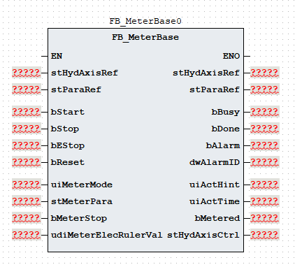
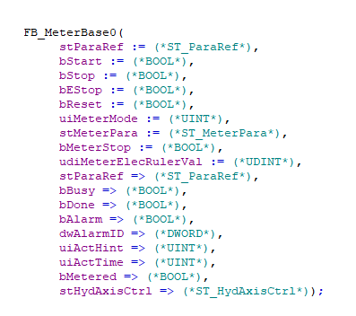

# 《FB_MeterBase 功能块使用说明》

| 项目 | 内容 |
|---|---|
| 模块名称 | `FB_MeterBase` |
| 适用场景 | 注塑机储料过程的多段压力、背压、速度和位置控制 |
| 版本信息 | 文档版本 1.0；库版本 1.0.0；更新日期 2026-08-20 |
| 事实原则 | 以下描述以当前 ST 执行逻辑为准；注释与实际逻辑不一致时标注“需协议确认” |

## 1. 功能概述

### 功能职责

`FB_MeterBase` 组织储料动作的启动、分段执行、完成和错误流程，将储料工艺参数、调模参数以及电子尺/停止反馈转换为轴控制命令，并输出储料状态、动作提示、动作时间和报警结果。功能块支持：

- 最多 8 个储料段；`uiMeterSegCnt` 按段数选择，初始化时换算为内部最后下标 `0..7`；输入 `0` 仍执行第 1 段；
- `uiMeterMode=1` 普通储料和 `uiMeterMode=2` 储料调模；
- `stMeterPara.uiMeterMode=1` 的电子尺位置结束，或 `stMeterPara.uiMeterMode=0` 的数字停止结束；
- 普通模式的压力、背压、速度、位置和分段斜率命令，以及调模模式的单组参数；
- 储料完成状态、当前段动作提示、阶段累计调用值、功能块报警和报警代码。

### 输入与输出

| 调用者提供 | 功能块输出 |
|---|---|
| `bStart`、`bStop`、`bEStop`、`bReset`、`uiMeterMode` | `bBusy`、`bDone`、`bAlarm`、`dwAlarmID` |
| `stMeterPara`、`stParaRef` | `uiActHint`、`uiActTime`、`bMetered` |
| `bMeterStop`、`udiMeterElecRulerVal`、`stHydAxisRef` | `stHydAxisCtrl` 轴命令和轴状态；`stHydAxisRef` 由内部 `FB_HydAxis` 调用后回写 |

### 主要执行流程

~~~text
读取 uiMeterMode 并确定普通储料/调模请求
  -> 按优先级处理复位、急停和停止（含 bStart 下降沿）
  -> Idle 接收 bStart 上升沿后进入 Init
  -> Init 将输入段数换算为内部最后下标 0..7，并设置储料方向
  -> Metering 按电子尺或数字停止条件执行当前段并生成速度模式轴命令
  -> 当前段结束后切换下一段，超过最后有效下标后进入 Metered
  -> 无效顶层模式或储料总限时到达进入 Error
  -> 当前 POU 调用内部 FB_HydAxis，回写 stHydAxisRef，并转存 stHydAxisCtrl
~~~

### 功能边界

本功能块生成储料工艺状态和轴命令，并在当前固定分支内调用内部 `FB_HydAxis`；不直接访问通信报文、全局变量、`%I/%Q` 或物理 I/O，不替代轴闭环、独立急停、安全联锁、机械限位、轴故障处理或物理能量切断。`FB_EleAxis` 分支虽然保留在 POU 中，但当前条件下不会执行；电动轴接入需要依据实际 POU 和轴库接口另行核对。

## 2. 自定义数据类型

### 2.1 `E_MeterState`

| 枚举成员 | 用途 |
|---|---|
| `eMeterState_Idle` | 空闲 |
| `eMeterState_Init` | 初始化 |
| `eMeterState_Metering` | 储料 |
| `eMeterState_Metered` | 储料完成 |
| `eMeterState_Error` | 错误 |

### 2.2 `ST_MeterSeg`

| 成员 | 类型 | 读写属性 | 用途 |
|---|---|---|---|
| `uiPres` | `UINT` | 只读 | 压力命令 |
| `uiBackPres` | `UINT` | 只读 | 背压命令 |
| `uiSpd` | `UINT` | 只读 | 速度命令 |
| `udiPos` | `UDINT` | 只读 | 位置目标 |
| `uiPresGrad` | `UINT` | 只读 | 压力斜率 |
| `uiSpdGrad` | `UINT` | 只读 | 速度斜率 |

### 2.3 `ST_MeterPara`

| 成员 | 类型 | 读写属性 | 用途 |
|---|---|---|---|
| `uiMeterSegCnt` | `UINT` | 只读 | 储料段数选择；收口到 `0..7` |
| `uiMeterMode` | `UINT` | 只读 | 储料方式：`0` 行程，`1` 位置 |
| `uiMeterLimitTime` | `UINT` | 只读 | 储料总限时 |
| `aMeterSeg` | `ARRAY[0..7] OF ST_MeterSeg` | 只读 | 储料分段参数 |
| `stMeterDebug` | `ST_MeterSeg` | 只读 | 储料调模参数 |
| `uiMeterDebugPresStartGrad` | `UINT` | 只读 | 储料调模压力启动斜率 |
| `uiMeterDebugPresStopGrad` | `UINT` | 只读 | 储料调模压力停止斜率 |
| `uiMeterDebugSpdStartGrad` | `UINT` | 只读 | 储料调模速度启动斜率 |
| `uiMeterDebugSpdStopGrad` | `UINT` | 只读 | 储料调模速度停止斜率 |
| `uiMeterPresStartGrad` | `UINT` | 只读 | 储料压力启动斜率 |
| `uiMeterPresStopGrad` | `UINT` | 只读 | 储料压力停止斜率 |
| `uiMeterSpdStartGrad` | `UINT` | 只读 | 储料速度启动斜率 |
| `uiMeterSpdStopGrad` | `UINT` | 只读 | 储料速度停止斜率 |

### 2.4 `ST_ParaRef`

| 成员 | 类型 | 读写属性 | 用途 |
|---|---|---|---|
| `udiPosToleranceValue` | `UDINT` | 读写 | 位置容差值 |

### 2.5 `ST_HydAxisRef`

该类型由液压轴库定义。本功能块将 `stHydAxisRef` 传入内部 `FB_HydAxis`，调用后用轴功能块返回值回写；结构成员请查阅 HydTechnology 技术库使用说明书。

### 2.6 `ST_HydAxisCtrl`

| 成员 | 类型 | 读写属性 | 用途 |
|---|---|---|---|
| `bAxisStart` | `BOOL` | 只写 | 轴启动/执行信号 |
| `uiAxisDir` | `UINT` | 只写 | 轴方向；储料写 `1` |
| `uiAxisMode` | `UINT` | 只写 | 轴控制模式：`1` 位置、`2` 速度、`3` 压力；储料固定写 `2` |
| `uiPresCmd` | `UINT` | 只写 | 压力命令 |
| `uiSpdCmd` | `UINT` | 只写 | 速度命令 |
| `uiEndSpdCmd` | `UINT` | 只写 | 段结束速度 |
| `udiPosCmd` | `UDINT` | 只写 | 位置命令 |
| `uiAxisPresAcc` | `UINT` | 只写 | 压力加速参数 |
| `uiAxisPresDec` | `UINT` | 只写 | 压力减速参数 |
| `uiAxisSpdAcc` | `UINT` | 只写 | 速度加速参数 |
| `uiAxisSpdDec` | `UINT` | 只写 | 速度减速参数 |
| `uiAxisJerk` | `UINT` | 只写 | 加加速度参数 |
| `bBusy` | `BOOL` | 内部轴功能块写入 | 液压轴忙状态 |
| `bDone` | `BOOL` | 内部轴功能块写入 | 液压轴完成状态 |
| `bInVelocity` | `BOOL` | 内部轴功能块写入 | 液压轴速度到位状态 |
| `bInPressure` | `BOOL` | 内部轴功能块写入 | 液压轴压力到位状态 |
| `bAlarm` | `BOOL` | 内部轴功能块写入 | 液压轴报警状态 |
| `dwAlarmID` | `DWORD` | 内部轴功能块写入 | 液压轴报警代码 |

## 3. 功能块接口

### 3.1 `VAR_IN_OUT`

| 名称 | 类型 | 当前行为 | 信号含义 |
|---|---|---|---|
| `stHydAxisRef` | `ST_HydAxisRef` | 传入内部 `FB_HydAxis`，调用后回写 | 液压轴参数引用参考 |
| `stParaRef` | `ST_ParaRef` | 引用位置容差值 | 工艺参数引用参考 |

### 3.2 `VAR_INPUT`

| 名称 | 类型 | 当前行为 | 信号含义 |
|---|---|---|---|
| `bStart` | `BOOL` | `Idle` 状态接收到上升沿后启动初始化 | 启动命令 |
| `bStop` | `BOOL` | 与 `bStart` 下降沿共同触发正常停止；回到空闲并清主要轴命令 | 正常停止 |
| `bEStop` | `BOOL` | 进入错误状态并置 `16#0001` | 急停请求 |
| `bReset` | `BOOL` | 最高优先级；清状态、报警、主要轴命令和计时 | 复位命令 |
| `uiMeterMode` | `UINT` | `1` 普通储料，`2` 储料调模；其他值（含 `0`）在初始化时报警 | 储料动作模式 |
| `stMeterPara` | `ST_MeterPara` | 动作过程中按周期读取分段、结束方式和斜率参数 | 储料工艺参数 |
| `bMeterStop` | `BOOL` | `stMeterPara.uiMeterMode=0` 时参与当前段结束判断 | 储料数字停止反馈 |
| `udiMeterElecRulerVal` | `UDINT` | `stMeterPara.uiMeterMode=1` 时与位置容差比较 | 储料电子尺位置反馈 |

### 3.3 `VAR_OUTPUT`

| 名称 | 类型 | 当前行为 | 信号含义 |
|---|---|---|---|
| `bBusy` | `BOOL` | 启动后置位；停止、完成、急停或错误时清除 | 忙状态 |
| `bDone` | `BOOL` | `Metered` 状态置位；`Idle` 或复位分支清除 | 完成状态 |
| `bAlarm` | `BOOL` | 无效模式或急停立即置位；限时在进入错误状态后置位；复位清除 | 报警状态 |
| `dwAlarmID` | `DWORD` | 报警代码按位 OR 累积；复位清零，停止和完成不自动清除 | 报警代码 |
| `uiActHint` | `UINT` | 输出空闲、报警、完成或储料段提示 | 动作提示 |
| `uiActTime` | `UINT` | 输出当前储料段累计调用值（按 `/1` 转换） | 动作时间 |
| `bMetered` | `BOOL` | 进入 `Metered` 状态后置位；`Idle` 或复位清除 | 储料完成状态 |
| `stHydAxisCtrl` | `ST_HydAxisCtrl` | 调用末尾转存当前轴命令和内部 `FB_HydAxis` 状态 | 轴命令和轴状态包 |

`stHydAxisCtrl` 中的轴状态字段来自内部 `FB_HydAxis`，与本功能块自身的 `bBusy`、`bDone`、`bAlarm` 和 `dwAlarmID` 分属不同层级。调用者应分别读取工艺层和轴层结果。

## 4. 报警和状态码

### 4.1 报警代码与报警信息

| 报警代码 | 报警信息 |
|---|---|
| `16#0000` | 无报警 |
| `16#0001` | 急停请求 |
| `16#0002` | `uiMeterMode` 参数无效 |
| `16#0004` | 储料限时报警 |

### 4.2 动作状态码

| `uiActHint` | 含义 |
|---:|---|
| `0` | 空闲 |
| `1` | 报警状态 |
| `2` | 储料完成 |
| `3` | 保留 |
| `10` | 保留 |
| `11..18` | 储料第 1～8 段 |

## 5. 调用规范和注意事项

1. **固定周期调用和计时。** 在稳定、已知周期内每周期调用一次，并在调用前刷新命令、模式、参数和现场反馈。当前逻辑每次 `Metering` 调用将阶段计时和总计时各增加 `1`，总限时比较值为 `uiMeterLimitTime×100`；`uiActTime` 由阶段累计值按 `/1` 转换得到，实际时间取决于调用周期。
2. **调用顺序和轴层边界。** 先准备 `stParaRef`、`stMeterPara`、`bMeterStop` 和 `udiMeterElecRulerVal`，再调用 `FB_MeterBase`，最后读取输出和 `stHydAxisCtrl`。当前 POU 已在固定分支内调用 `FB_HydAxis` 并回写 `stHydAxisRef`，调用者不得为了同一动作再次重复调用外部轴功能块；轴层诊断应读取 `stHydAxisCtrl` 的状态字段。
3. **模式与结束方式。** 顶层 `uiMeterMode` 只允许 `1` 普通储料或 `2` 储料调模，其他值（含 `0`）在 `Init` 写入 `16#0002`；参数内 `stMeterPara.uiMeterMode` 只允许 `0` 数字停止或 `1` 电子尺，两者含义不同。模式应在启动前确定并保持；参数内模式为其他值时当前逻辑没有独立报警，可能只能等待总限时。
4. **分段和反馈配置。** `uiMeterSegCnt` 是段数选择：`1..8` 在初始化时换算为内部最后下标 `0..7`，大于 `8` 收口到 `7`，输入 `0` 仍执行第 1 段。当前段按电子尺条件 `udiMeterElecRulerVal + stParaRef.udiPosToleranceValue >= aMeterSeg[index].udiPos` 或数字停止条件 `bMeterStop` 结束；调模命令替换不改变该结束条件。电子尺容差、位置单调性和停止信号合理性不由本功能块检查。
5. **启动、停止、复位和输出保持。** `bStart` 在 `Idle` 中使用上升沿启动，下降沿与 `bStop` 一样触发正常停止；`bStop` 清主要轴命令和计时但不清报警码，`bReset` 优先级高于急停并清除状态和报警。活动段期间 `bAxisStart` 持续为 `TRUE`，`uiAxisMode=2` 表示当前速度模式命令；`bBusy` 是工艺状态，不等同于轴忙状态。储料完成分支清除主要压力、背压、速度、结束速度和位置命令。
6. **未实现字段、单位和安全边界。** 普通模式的 `uiMeterPresStopGrad`、`uiMeterSpdStopGrad` 当前未读取；调模模式使用对应调模停止斜率。`uiAxisPresAcc`/`uiAxisPresDec` 只转存到 `stHydAxisCtrl`，内部 `FB_HydAxis` 当前接收速度加减速和 `uiAxisJerk`，其中 `uiAxisJerk` 无可靠赋值来源；背压参数未写入 `ST_HydAxisCtrl` 且未传入 `FB_HydAxis`，其执行需协议确认。本功能块也不替代独立急停、安全门/光幕、机械限位、轴故障处理或物理能量切断。

## 6. 外部交互边界

| 方向 | 交互对象 | 数据边界 |
|---|---|---|
| 输入 | HMI、配方和上层工艺逻辑 | `uiMeterMode`、`stMeterPara`、启动/停止/急停/复位命令 |
| 输入 | 现场信号转换层 | `bMeterStop`、`udiMeterElecRulerVal`；位置容差通过 `stParaRef` 提供 |
| 内部调用 | `FB_HydAxis` | 传入 `stHydAxisRef`、启动/停止/急停/复位、方向、模式、压力、速度、结束速度、位置和斜率；调用后回写 `stHydAxisRef` |
| 输出 | HMI、诊断和报警层 | `bBusy`、`bDone`、`bMetered`、`uiActHint`、`uiActTime`、`bAlarm`、`dwAlarmID` 以及 `stHydAxisCtrl` |

当前 POU 不直接访问通信报文、全局变量、`%I/%Q` 或物理 I/O。`FB_EleAxis` 仅为保留分支，当前固定条件下不执行；电动轴边界不能从当前分支推导。`stHydAxisCtrl` 是轴命令/状态的对外镜像。

## 7. 最小调用示例

### 7.1 调用储料功能块

以下示例使用通用占位符。上层逻辑在调用前准备输入和引用结构；`FB_MeterBase` 内部完成 `R_TRIG`/`F_TRIG` 检测及 `FB_HydAxis` 调用，示例不重复调用外部轴功能块。

~~~ST
(* 上层逻辑准备 bStart、uiMeterMode、stMeterPara 和现场反馈。 *)

(* 调用储料工艺功能块；停止、急停和复位信号由上层逻辑提供。 *)
fbExample(
    stHydAxisRef := stHydAxisRef,
    stParaRef := stParaRef,
    bStart := bStart,
    bStop := bStop,
    bEStop := bEStop,
    bReset := bReset,
    uiMeterMode := uiMeterMode,
    stMeterPara := stMeterPara,
    bMeterStop := bMeterStop,
    udiMeterElecRulerVal := udiMeterElecRulerVal,
    bBusy => bMeterBusy,
    bDone => bMeterDone,
    bAlarm => bMeterAlarm,
    dwAlarmID => dwMeterAlarmID,
    uiActHint => uiMeterActHint,
    uiActTime => uiMeterActTime,
    bMetered => bMetered,
    stHydAxisCtrl => stMeterHydAxisCtrl
);

(* 轴层状态从 stMeterHydAxisCtrl 读取，工艺报警与轴报警分开处理。 *)
bHydAxisAlarm := stMeterHydAxisCtrl.bAlarm;
dwHydAxisAlarmID := stMeterHydAxisCtrl.dwAlarmID;
~~~
