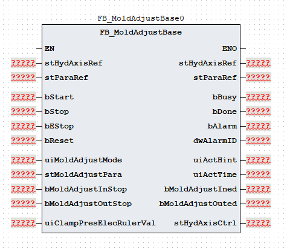
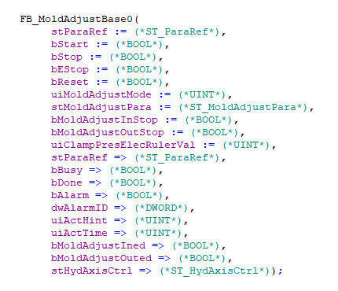

# 《FB_MoldAdjustBase 功能块使用说明》

| 项目 | 内容 |
|---|---|
| 模块名称 | `FB_MoldAdjustBase` |
| 适用场景 | 注塑机调模进、调模退的单段工艺控制 |
| 版本信息 | 文档版本 1.0；库版本 1.0.0；更新日期 2026-08-20 |
| 事实原则 | 以下描述以当前 ST 执行逻辑为准；注释与实际逻辑不一致时标注“需协议确认” |

## 1. 功能概述

### 功能职责

`FB_MoldAdjustBase` 组织调模进和调模退的启动、单段执行、结束、完成及错误流程，将调模工艺参数和数字停止反馈转换为轴控制命令，并输出动作状态、完成状态和报警结果。功能块支持：

- 调模进和调模退两种动作请求；
- 每个方向一段压力、速度和时间参数；
- 按时间或数字停止反馈结束动作；
- 调模进、调模退独立限制时间；
- 速度模式轴命令、压力/速度斜率输出；
- 调模进完成、调模退完成、动作提示和报警代码输出。

### 输入与输出

| 调用者提供 | 功能块输出 |
|---|---|
| `bStart`、`bStop`、`bEStop`、`bReset`、`uiMoldAdjustMode` | `bBusy`、`bDone`、`bAlarm`、`dwAlarmID` |
| `stMoldAdjustPara`、`stParaRef` | `uiActHint`、`uiActTime`、`bMoldAdjustIned`、`bMoldAdjustOuted` |
| `bMoldAdjustInStop`、`bMoldAdjustOutStop`、`uiClampPresElecRulerVal`、`stHydAxisRef` | `stHydAxisCtrl` 轴命令和轴状态；`stHydAxisRef` 由内部 `FB_HydAxis` 调用后回写 |

### 主要执行流程

~~~text
读取 uiMoldAdjustMode 并确定调模进/调模退请求
  -> 按优先级处理复位、急停和停止（含 bStart 下降沿）
  -> Idle 接收 bStart 上升沿后进入 Init
  -> Init 设置方向，进入调模进或调模退单段状态
  -> 按时间或对应数字停止反馈结束单段并进入方向完成状态
  -> 调模进/退总限时到达或顶层模式无效时进入 Error
  -> 当前 POU 调用内部 FB_HydAxis，回写 stHydAxisRef，并转存 stHydAxisCtrl
~~~

### 功能边界

本功能块生成调模工艺状态和轴命令，并在当前固定分支内调用内部 `FB_HydAxis`；不直接访问通信报文、全局变量、`%I/%Q` 或物理 I/O，不替代轴闭环、独立急停、安全联锁、机械限位、轴故障处理或物理能量切断。`FB_EleAxis` 分支虽然保留在 POU 中，但当前条件下不会执行；电动轴接入需要依据实际 POU 和轴库接口另行核对。

## 2. 自定义数据类型

### 2.1 `E_MoldAdjustState`

| 枚举成员 | 用途 |
|---|---|
| `eMoldAdjustState_Idle` | 空闲 |
| `eMoldAdjustState_Init` | 初始化 |
| `eMoldAdjustState_MoldAdjustIning` | 调模进 |
| `eMoldAdjustState_MoldAdjustIned` | 调模进完成 |
| `eMoldAdjustState_MoldAdjustOuting` | 调模退 |
| `eMoldAdjustState_MoldAdjustOuted` | 调模退完成 |
| `eMoldAdjustState_Error` | 错误 |

### 2.2 `ST_MoldAdjustSeg`

| 成员 | 类型 | 读写属性 | 用途 |
|---|---|---|---|
| `uiPres` | `UINT` | 只读 | 压力命令 |
| `uiSpd` | `UINT` | 只读 | 速度命令 |
| `uiTime` | `UINT` | 只读 | 时间阈值 |

### 2.3 `ST_MoldAdjustPara`

| 成员 | 类型 | 读写属性 | 用途 |
|---|---|---|---|
| `uiMoldAdjustInMode` | `UINT` | 只读 | 调模进方式：`0` 时间、`1` 行程 |
| `uiMoldAdjustInLimitTime` | `UINT` | 只读 | 调模进总限时；`0` 时不启用 |
| `stMoldAdjustInSeg` | `ST_MoldAdjustSeg` | 只读 | 调模进单段参数 |
| `uiMoldAdjustInPresStartGrad` | `UINT` | 只读 | 调模进压力启动斜率 |
| `uiMoldAdjustInPresStopGrad` | `UINT` | 只读 | 调模进压力停止斜率 |
| `uiMoldAdjustInSpdStartGrad` | `UINT` | 只读 | 调模进速度启动斜率 |
| `uiMoldAdjustInSpdStopGrad` | `UINT` | 只读 | 调模进速度停止斜率 |
| `uiMoldAdjustOutMode` | `UINT` | 只读 | 调模退方式：`0` 时间、`1` 行程 |
| `uiMoldAdjustOutLimitTime` | `UINT` | 只读 | 调模退总限时；`0` 时不启用 |
| `stMoldAdjustOutSeg` | `ST_MoldAdjustSeg` | 只读 | 调模退单段参数 |
| `uiMoldAdjustOutPresStartGrad` | `UINT` | 只读 | 调模退压力启动斜率 |
| `uiMoldAdjustOutPresStopGrad` | `UINT` | 只读 | 调模退压力停止斜率 |
| `uiMoldAdjustOutSpdStartGrad` | `UINT` | 只读 | 调模退速度启动斜率 |
| `uiMoldAdjustOutSpdStopGrad` | `UINT` | 只读 | 调模退速度停止斜率 |

### 2.4 `ST_ParaRef`

| 成员 | 类型 | 读写属性 | 用途 |
|---|---|---|---|
| `udiPosToleranceValue` | `UDINT` | 读写 | 位置容差值 |

### 2.5 `ST_HydAxisRef`

该类型由液压轴库定义。本功能块将 `stHydAxisRef` 传入内部 `FB_HydAxis`，调用后用轴功能块返回值回写；结构成员请查阅 HydTechnology 技术库使用说明书。

### 2.6 `ST_HydAxisCtrl`

| 成员 | 类型 | 读写属性 | 用途 |
|---|---|---|---|
| `bAxisStart` | `BOOL` | 只写 | 轴启动/执行信号 |
| `uiAxisDir` | `UINT` | 只写 | 轴方向；调模进写 `2`，调模退写 `1` |
| `uiAxisMode` | `UINT` | 只写 | 轴控制模式：`0` 无效、`1` 位置、`2` 速度、`3` 压力；本功能块写 `2` |
| `uiPresCmd` | `UINT` | 只写 | 压力命令 |
| `uiSpdCmd` | `UINT` | 只写 | 速度命令 |
| `uiEndSpdCmd` | `UINT` | 只写 | 结束速度 |
| `udiPosCmd` | `UDINT` | 只写 | 位置命令 |
| `uiAxisPresAcc` | `UINT` | 只写 | 压力加速参数 |
| `uiAxisPresDec` | `UINT` | 只写 | 压力减速参数 |
| `uiAxisSpdAcc` | `UINT` | 只写 | 速度加速参数 |
| `uiAxisSpdDec` | `UINT` | 只写 | 速度减速参数 |
| `uiAxisJerk` | `UINT` | 只写 | 加加速度参数 |
| `bBusy` | `BOOL` | 内部轴功能块写入 | 液压轴忙状态 |
| `bDone` | `BOOL` | 内部轴功能块写入 | 液压轴完成状态 |
| `bInVelocity` | `BOOL` | 内部轴功能块写入 | 液压轴速度到位状态 |
| `bInPressure` | `BOOL` | 内部轴功能块写入存 | 液压轴压力到位状态 |
| `bAlarm` | `BOOL` | 内部轴功能块写入 | 液压轴报警状态 |
| `dwAlarmID` | `DWORD` | 内部轴功能块写入 | 液压轴报警代码 |

## 3. 功能块接口

### 3.1 `VAR_IN_OUT`

| 名称 | 类型 | 当前行为 | 信号含义 |
|---|---|---|---|
| `stHydAxisRef` | `ST_HydAxisRef` | 传入内部 `FB_HydAxis`，调用后回写 | 液压轴参数引用参考 |
| `stParaRef` | `ST_ParaRef` | 引用位置容差值 | 工艺参数引用参考 

### 3.2 `VAR_INPUT`

| 名称 | 类型 | 当前行为 | 信号含义 |
|---|---|---|---|
| `bStart` | `BOOL` | 内部检测上升沿；`Idle` 状态接收到上升沿后进入初始化 | 启动命令 |
| `bStop` | `BOOL` | 与 `bStart` 下降沿共同触发正常停止；回到空闲并清主要轴命令 | 正常停止 |
| `bEStop` | `BOOL` | 进入错误状态并按位加入 `16#0001` | 急停请求 |
| `bReset` | `BOOL` | 最高优先级；清状态、报警、主要轴命令和计时 | 复位命令 |
| `uiMoldAdjustMode` | `UINT` | `1` 调模进，`2` 调模退；其他值在初始化时报警 | 调模方向模式 |
| `stMoldAdjustPara` | `ST_MoldAdjustPara` | 按周期读取方向、结束方式、单段参数和斜率 | 调模工艺参数 |
| `bMoldAdjustInStop` | `BOOL` | 调模进结束方式为 `1` 时参与调模进结束判断 | 调模进数字停止反馈 |
| `bMoldAdjustOutStop` | `BOOL` | 调模退结束方式为 `1` 时参与调模退结束判断 | 调模退数字停止反馈 |
| `uiClampPresElecRulerVal` | `UINT` | 声明但当前暂未使用 | 锁模压力 |

### 3.3 `VAR_OUTPUT`

| 名称 | 类型 | 当前行为 | 信号含义 |
|---|---|---|---|
| `bBusy` | `BOOL` | 启动后置位；完成、停止、急停或错误状态清除 | 忙状态 |
| `bDone` | `BOOL` | 调模进或调模退完成状态置位；`Idle` 或复位清除 | 完成状态 |
| `bAlarm` | `BOOL` | 无效模式、急停或错误状态置位；复位清除，停止和空闲不自动清除 | 报警状态 |
| `dwAlarmID` | `DWORD` | 报警代码按位 OR 累积；复位清零，停止、完成和空闲不自动清除 | 报警代码 |
| `uiActHint` | `UINT` | 输出空闲、报警、调模进、调模退或对应完成提示 | 动作提示 |
| `uiActTime` | `UINT` | 输出当前方向阶段累计调用值转换结果 | 动作时间 |
| `bMoldAdjustIned` | `BOOL` | 进入调模进完成状态后置位；`Idle` 或复位清除 | 调模进完成 |
| `bMoldAdjustOuted` | `BOOL` | 进入调模退完成状态后置位；`Idle` 或复位清除 | 调模退完成 |
| `stHydAxisCtrl` | `ST_HydAxisCtrl` | 调用末尾转存当前周期轴命令和内部 `FB_HydAxis` 状态 | 轴命令和轴状态包 |

`stHydAxisCtrl` 的轴状态字段来自内部 `FB_HydAxis`，与本功能块自身的 `bBusy`、`bDone`、`bAlarm` 和 `dwAlarmID` 分属不同层级。调用者应分别读取工艺层和轴层结果。

## 4. 报警和状态码

### 4.1 报警代码与报警信息

| 报警代码 | 报警信息 |
|---|---|
| `16#0000` | 无报警 |
| `16#0001` | 紧急停止 |
| `16#0002` | `uiMoldAdjustMode` 参数无效 |
| `16#0004` | 调模进限时报警 |
| `16#0008` | 调模退限时报警 |

### 4.2 动作状态码

| `uiActHint` | 含义 |
|---:|---|
| `0` | 空闲 |
| `1` | 报警状态 |
| `2` | 调模进完成 |
| `3` | 调模退完成 |
| `11` | 调模进 |
| `21` | 调模退 |

## 5. 调用规范和注意事项

1. **固定周期调用和计时。** 在稳定、已知周期内每周期调用一次，并在调用前刷新模式、调模参数和数字停止反馈。当前活动阶段每次调用把阶段计时和总计时各增加 `1`；单段时间和方向总限时都使用参数值乘 `100` 次调用比较，`uiActTime` 是调用值转换结果，实际时间取决于调用周期。
2. **调用顺序和轴层边界。** 先准备 `stHydAxisRef`、`stMoldAdjustPara`、`uiMoldAdjustMode` 和停止反馈，再调用 `FB_MoldAdjustBase`，最后读取 `stHydAxisCtrl`、动作输出和回写后的 `stHydAxisRef`。当前 POU 已在固定分支内调用 `FB_HydAxis`，调用者不得为同一动作重复调用外部轴功能块。
3. **模式、范围和单位。** 顶层 `uiMoldAdjustMode` 只允许 `1` 调模进或 `2` 调模退；方向参数内 `uiMoldAdjustInMode`/`uiMoldAdjustOutMode` 只允许 `0` 时间或 `1` 数字停止，其他值无独立报警。模式应在启动前确定并保持，活动过程中改变顶层模式不会切换已进入的状态。总限时为 `0` 时禁用；单段时间为 `0` 且结束方式为时间时会在活动阶段立即满足结束条件。压力、速度、时间、斜率和方向编码的单位/范围需协议确认；`stParaRef.udiPosToleranceValue` 和 `uiClampPresElecRulerVal` 当前未使用。
4. **启动、停止、急停与复位。** `bStart` 在 `Idle` 中使用上升沿启动，下降沿与 `bStop` 一样触发正常停止；处理优先级为 `bReset > bEStop > bStop/下降沿 > 状态机`。停止切回 `Idle`、清主要轴命令和两个计时值，但不显式清 `uiActTime`、完成标志或报警；这些输出由后续 `Idle`/复位按当前分支处理。急停保持有效时，复位后的下一次调用会重新进入急停处理。
5. **清零、保持与未实现字段。** `bBusy` 在完成、停止、急停和错误状态清除；`bDone`、方向完成标志和动作提示在 `Idle`/复位或对应状态中更新，但停止、急停和错误分支不显式清除此前已置位的完成标志；`dwAlarmID` 和 `bAlarm` 由复位清除，停止、完成和空闲不自动清除。活动结束分支显式清零压力、速度和位置命令，但未显式清零 `uiEndSpdCmd`、四个斜率字段、`uiAxisDir` 或 `uiAxisJerk`；活动阶段 `bAxisStart=TRUE`、`uiAxisMode=2`，`udiPosCmd` 没有位置目标来源且不能作为调模行程依赖。
6. **执行层、报警状态与安全边界。** 内部 `FB_HydAxis` 接收 `stHydAxisRef`、启停/急停/复位、方向、模式、压力、速度、结束速度、位置和斜率字段，调用后回写引用结构；`stHydAxisCtrl` 的轴状态与工艺 `bBusy`/`bDone`/`bAlarm`/`dwAlarmID` 分层读取。`bAxisStart` 表示执行信号，`uiAxisMode` 表示命令模式，两者均不能替代轴层忙/完成状态。本功能块不替代独立急停、安全门/光幕、机械限位、调模互锁、轴故障处理或物理能量切断。

## 6. 外部交互边界

| 方向 | 交互对象 | 数据边界 |
|---|---|---|
| 输入 | HMI、配方和上层工艺逻辑 | `uiMoldAdjustMode`、`stMoldAdjustPara`、启动/停止/急停/复位命令 |
| 输入 | 现场信号转换层 | `bMoldAdjustInStop`、`bMoldAdjustOutStop` |
| 输入 | 保留接口 | `stParaRef`、`uiClampPresElecRulerVal` 当前未被本功能块读取 |
| 内部调用 | `FB_HydAxis` | 传入 `stHydAxisRef`、启停/急停/复位、方向、模式、压力、速度、结束速度、位置和斜率；调用后回写 `stHydAxisRef` |
| 输出 | HMI、诊断和报警层 | `bBusy`、`bDone`、`bMoldAdjustIned`、`bMoldAdjustOuted`、`uiActHint`、`uiActTime`、`bAlarm`、`dwAlarmID` 和 `stHydAxisCtrl` |

当前 POU 不直接访问通信报文、全局变量、`%I/%Q` 或物理 I/O。`FB_EleAxis` 仅为保留分支，当前固定条件下不执行；电动轴边界不能从当前分支推导。轴层报警应与工艺层报警分层汇总，不能将 `stHydAxisCtrl.dwAlarmID` 直接当作本功能块报警代码。

## 7. 最小调用示例

### 7.1 调用调模功能块

以下示例使用通用占位符。上层逻辑先准备模式、单段参数和停止反馈；`FB_MoldAdjustBase` 内部完成启动边沿检测及 `FB_HydAxis` 调用，示例不重复调用外部轴功能块。

~~~ST
(* 上层逻辑准备 uiMoldAdjustMode、stMoldAdjustPara 和停止反馈。 *)

(* 调用调模工艺功能块；停止、急停和复位信号由上层逻辑提供。 *)
fbExample(
    stHydAxisRef := stHydAxisRef,
    stParaRef := stParaRef,
    bStart := bStart,
    bStop := bStop,
    bEStop := bEStop,
    bReset := bReset,
    uiMoldAdjustMode := uiMoldAdjustMode,
    stMoldAdjustPara := stMoldAdjustPara,
    bMoldAdjustInStop := bMoldAdjustInStop,
    bMoldAdjustOutStop := bMoldAdjustOutStop,
    uiClampPresElecRulerVal := uiClampPresElecRulerVal,
    bBusy => bMoldAdjustBusy,
    bDone => bMoldAdjustDone,
    bAlarm => bMoldAdjustAlarm,
    dwAlarmID => dwMoldAdjustAlarmID,
    uiActHint => uiMoldAdjustActHint,
    uiActTime => uiMoldAdjustActTime,
    bMoldAdjustIned => bMoldAdjustIned,
    bMoldAdjustOuted => bMoldAdjustOuted,
    stHydAxisCtrl => stMoldAdjustHydAxisCtrl
);

(* 工艺报警与内部液压轴报警分层读取。 *)
bHydAxisAlarm := stMoldAdjustHydAxisCtrl.bAlarm;
dwHydAxisAlarmID := stMoldAdjustHydAxisCtrl.dwAlarmID;
~~~
