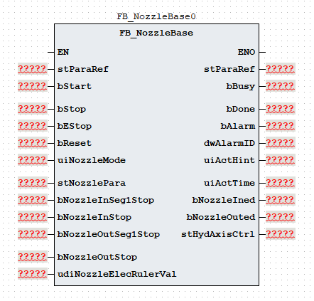
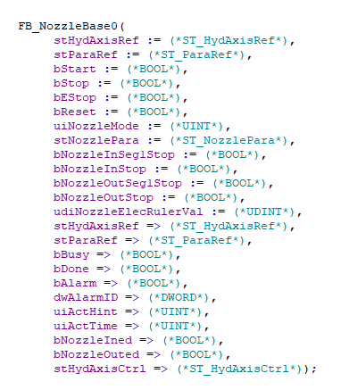

# 《FB_NozzleBase 功能块使用说明》

| 项目 | 内容 |
|---|---|
| 模块名称 | `FB_NozzleBase` |
| 适用场景 | 注塑机座台进、座台退的两段工艺控制 |
| 版本信息 | 文档版本 1.0；库版本 1.0.0；更新日期 2026-08-20 |
| 事实原则 | 以下描述以当前 ST 执行逻辑为准；注释与实际逻辑不一致时标注“需协议确认” |

## 1. 功能概述

### 功能职责

`FB_NozzleBase` 组织座台进、座台退的启动、分段执行、完成和错误流程，将座台工艺参数转换为 `stHydAxisCtrl` 轴命令，并交给内部轴功能块执行，同时输出动作状态、完成状态和报警结果。功能块支持：

- 座台进最多 2 段；
- 座台退最多 2 段；
- 座台进、座台退普通模式和调模模式；
- 时间、数字停止信号和电子尺位置三种段结束方式；
- 座台进完成、座台退完成、动作提示、报警状态和报警代码输出。

### 输入与输出

| 调用者提供 | 功能块输出 |
|---|---|
| `bStart`、`bStop`、`bEStop`、`bReset`、`uiNozzleMode` | `bBusy`、`bDone`、`bAlarm`、`dwAlarmID` |
| `stNozzlePara`、`stParaRef` | `uiActHint`、`uiActTime`、`bNozzleIned`、`bNozzleOuted` |
| `stHydAxisRef`、座台进/退停止信号、电子尺位置 | `stHydAxisCtrl` 轴命令和轴状态包；`stHydAxisRef` 回写轴状态 |

### 主要执行流程

~~~text
读取 uiNozzleMode 并确定座台进/退方向及调模标志
  -> 按优先级处理复位、急停和停止
  -> Idle 接收 bStart 上升沿后进入 Init
  -> 座台进：NozzleIning[0..1] -> NozzleIned
  -> 座台退：NozzleOuting[0..1] -> NozzleOuted
  -> 无效模式或对应方向限时到 -> Error
  -> 内部调用 FB_HydAxis，回写 stHydAxisRef 并转存轴命令和轴状态到 stHydAxisCtrl
~~~

### 功能边界

本功能块生成座台工艺状态和轴命令，并在当前 ST 的固定分支中直接调用 `FB_HydAxis`；不访问通信报文、全局变量、`%I/%Q` 或物理 I/O，独立急停、机械限位、安全联锁和物理能量切断仍不由本功能块提供。`FB_EleAxis` 分支虽然保留在 ST 中，但当前 `IF TRUE` 条件下不会执行；电动轴切换需先修改并核对实际 POU 实现。

## 2. 自定义数据类型

### 2.1 `E_NozzleState`

| 枚举成员 | 用途 |
|---|---|
| `eNozzleState_Idle` | 空闲 |
| `eNozzleState_Init` | 初始化 |
| `eNozzleState_NozzleIning` | 座台进 |
| `eNozzleState_NozzleIned` | 座台进完成 |
| `eNozzleState_NozzleOuting` | 座台退 |
| `eNozzleState_NozzleOuted` | 座台退完成 |
| `eNozzleState_Error` | 错误 |

### 2.2 `ST_NozzleSeg`

| 成员 | 类型 | 读写属性 | 用途 |
|---|---|---|---|
| `uiPres` | `UINT` | 只读 | 压力命令 |
| `uiSpd` | `UINT` | 只读 | 速度命令 |
| `udiPos` | `UDINT` | 只读 | 位置目标 |
| `uiTime` | `UINT` | 只读 | 时间阈值 |
| `uiPresGrad` | `UINT` | 只读 | 压力斜率 |
| `uiSpdGrad` | `UINT` | 只读 | 速度斜率 |

### 2.3 `ST_NozzlePara`

| 成员 | 类型 | 读写属性 | 用途 |
|---|---|---|---|
| `uiAutoNozzleRetract` | `UINT` | 只读 | 自动座退选择 |
| `uiNozzleInSegCnt` | `UINT` | 只读 | 座台进段数选择；收口到 `0..1` |
| `uiNozzleInMode` | `UINT` | 只读 | 座台进方式：`0` 时间、`1` 行程、`2` 位置 |
| `uiNozzleInLimitTime` | `UINT` | 只读 | 座台进总时限 |
| `aNozzleInSeg` | `ARRAY[0..1] OF ST_NozzleSeg` | 只读 | 座台进分段参数 |
| `stNozzleInDebug` | `ST_NozzleSeg` | 只读 | 座台进调模参数 |
| `uiNozzleInDebugPresStartGrad` | `UINT` | 只读 | 座台进调模压力启动斜率 |
| `uiNozzleInDebugPresStopGrad` | `UINT` | 只读 | 座台进调模压力停止斜率 |
| `uiNozzleInDebugSpdStartGrad` | `UINT` | 只读 | 座台进调模速度启动斜率 |
| `uiNozzleInDebugSpdStopGrad` | `UINT` | 只读 | 座台进调模速度停止斜率 |
| `uiNozzleInPresStartGrad` | `UINT` | 只读 | 座台进压力启动斜率 |
| `uiNozzleInPresStopGrad` | `UINT` | 只读 | 座台进压力停止斜率 |
| `uiNozzleInSpdStartGrad` | `UINT` | 只读 | 座台进速度启动斜率 |
| `uiNozzleInSpdStopGrad` | `UINT` | 只读 | 座台进速度停止斜率 |
| `uiNozzleOutSegCnt` | `UINT` | 只读 | 座台退段数选择；收口到 `0..1` |
| `uiNozzleOutMode` | `UINT` | 只读 | 座台退方式：`0` 时间、`1` 行程、`2` 位置 |
| `uiNozzleOutLimitTime` | `UINT` | 只读 | 座台退总时限 |
| `aNozzleOutSeg` | `ARRAY[0..1] OF ST_NozzleSeg` | 只读 | 座台退分段参数 |
| `stNozzleOutDebug` | `ST_NozzleSeg` | 只读 | 座台退调模参数 |
| `uiNozzleOutDebugPresStartGrad` | `UINT` | 只读 | 座台退调模压力启动斜率 |
| `uiNozzleOutDebugPresStopGrad` | `UINT` | 只读 | 座台退调模压力停止斜率 |
| `uiNozzleOutDebugSpdStartGrad` | `UINT` | 只读 | 座台退调模速度启动斜率 |
| `uiNozzleOutDebugSpdStopGrad` | `UINT` | 只读 | 座台退调模速度停止斜率 |
| `uiNozzleOutPresStartGrad` | `UINT` | 只读 | 座台退压力启动斜率 |
| `uiNozzleOutPresStopGrad` | `UINT` | 只读 | 座台退压力停止斜率 |
| `uiNozzleOutSpdStartGrad` | `UINT` | 只读 | 座台退速度启动斜率 |
| `uiNozzleOutSpdStopGrad` | `UINT` | 只读 | 座台退速度停止斜率 |

### 2.4 `ST_ParaRef`

| 成员 | 类型 | 读写属性 | 用途 |
|---|---|---|---|
| `udiPosToleranceValue` | `UDINT` | 读写 | 位置容差值 |

### 2.5 `ST_HydAxisRef`

该类型由液压轴库定义。`FB_NozzleBase` 将其传入内部 `FB_HydAxis`，调用后再回写；结构成员请查阅HydTechnology 技术库使用说明书。

### 2.6 `ST_HydAxisCtrl`

| 成员 | 类型 | 读写属性 | 用途 |
|---|---|---|---|
| `bAxisStart` | `BOOL` | 只写 | 轴启动信号 |
| `uiAxisDir` | `UINT` | 只写 | 轴方向值；座台进写 `2`、座台退写 `1` |
| `uiAxisMode` | `UINT` | 只写 | 轴命令模式：`1` 位置、`2` 速度、`3` 压力 |
| `uiPresCmd` | `UINT` | 只写 | 压力命令 |
| `uiSpdCmd` | `UINT` | 只写 | 速度命令 |
| `uiEndSpdCmd` | `UINT` | 只写 | 段结束速度 |
| `udiPosCmd` | `UDINT` | 只写 | 位置命令 |
| `uiAxisPresAcc` | `UINT` | 只写 | 压力加速度参数 |
| `uiAxisPresDec` | `UINT` | 只写 | 压力减速度参数 |
| `uiAxisSpdAcc` | `UINT` | 只写 | 速度加速度参数 |
| `uiAxisSpdDec` | `UINT` | 只写 | 速度减速度参数 |
| `uiAxisJerk` | `UINT` | 只写 | 加加速度参数 |
| `bBusy` | `BOOL` | 内部轴功能块写入 | 液压轴忙状态 |
| `bDone` | `BOOL` | 内部轴功能块写入 | 液压轴完成状态 |
| `bInVelocity` | `BOOL` | 内部轴功能块写入 | 液压轴速度到位状态 |
| `bInPressure` | `BOOL` | 内部轴功能块写入 | 液压轴压力到位状态 |
| `bAlarm` | `BOOL` | 内部轴功能块写入 | 液压轴报警状态 |
| `dwAlarmID` | `DWORD` | 内部轴功能块写入 | 液压轴报警代码 |

## 3. 功能块接口

### 3.1 `VAR_IN_OUT`

| 名称 | 类型 | 当前行为 | 信号含义 |
|---|---|---|---|
| `stHydAxisRef` | `ST_HydAxisRef` | 传入内部 `FB_HydAxis`，调用后回写 | 液压轴参数引用参考 |
| `stParaRef` | `ST_ParaRef` | 引用位置容差值 | 工艺参数引用参考 |

### 3.2 `VAR_INPUT`

| 名称 | 类型 | 当前行为 | 信号含义 |
|---|---|---|---|
| `bStart` | `BOOL` | `Idle` 状态下进入初始化 | 启动命令 |
| `bStop` | `BOOL` | 优先级低于复位和急停；回到空闲并清主要轴命令 | 正常停止 |
| `bEStop` | `BOOL` | 进入错误状态并置急停报警 | 急停请求 |
| `bReset` | `BOOL` | 最高优先级；清状态、报警和主要轴命令 | 复位命令 |
| `uiNozzleMode` | `UINT` | 选择座台进、座台退或对应调模模式 | 座台动作模式 |
| `stNozzlePara` | `ST_NozzlePara` | 动作过程中按周期读取 | 座台工艺参数 |
| `bNozzleInSeg1Stop` | `BOOL` | 座台进且参数模式为 `1` 时仅参与第 0 段结束判断 | 座台进一级停止 |
| `bNozzleInStop` | `BOOL` | 座台进且参数模式为 `1` 时参与所有分段结束判断 | 座台进停止反馈 |
| `bNozzleOutSeg1Stop` | `BOOL` | 座台退且参数模式为 `1` 时仅参与第 0 段结束判断 | 座台退一级停止 |
| `bNozzleOutStop` | `BOOL` | 座台退且参数模式为 `1` 时参与所有分段结束判断 | 座台退停止反馈 |
| `udiNozzleElecRulerVal` | `UDINT` | 参数模式为 `2` 时参与位置比较 | 座台位置反馈 |

### 3.3 `VAR_OUTPUT`

| 名称 | 类型 | 当前行为 | 信号含义 |
|---|---|---|---|
| `bBusy` | `BOOL` | 启动后置位；停止、完成、急停或错误时清除 | 忙状态 |
| `bDone` | `BOOL` | 座台进或座台退完成状态置位；在 `Idle` 或复位分支清除 | 完成状态 |
| `bAlarm` | `BOOL` | 错误状态置位；复位清除 | 报警状态 |
| `dwAlarmID` | `DWORD` | 报警按位 OR 保持；复位清零 | 报警代码 |
| `uiActHint` | `UINT` | 输出空闲、座台进/退分段、完成或错误提示 | 动作提示 |
| `uiActTime` | `UINT` | 输出当前阶段累计调用值 | 动作时间 |
| `bNozzleIned` | `BOOL` | 座台进完成状态置位；空闲或复位清除 | 座台进完成 |
| `bNozzleOuted` | `BOOL` | 座台退完成状态置位；空闲或复位清除 | 座台退完成 |
| `stHydAxisCtrl` | `ST_HydAxisCtrl` | 调用末尾转存轴命令和内部 `FB_HydAxis` 状态 | 轴命令和轴状态包 |

`stHydAxisCtrl.bBusy`、`bDone`、`bInVelocity`、`bInPressure`、`bAlarm` 和 `dwAlarmID` 来自内部 `FB_HydAxis`，与功能块本身的 `bBusy`、`bDone`、`bAlarm` 和 `dwAlarmID` 分属不同层级。功能块报警代码和轴报警代码应分别读取，不应直接互换。

## 4. 报警和状态码

### 4.1 报警代码与报警信息

| 报警代码 | 报警信息 |
|---|---|
| `16#0000` | 无报警 |
| `16#0001` | 紧急停止 |
| `16#0002` | `uiNozzleMode` 参数无效 |
| `16#0004` | 座台进限时报警 |
| `16#0008` | 座台退限时报警 |

### 4.2 动作状态码

| `uiActHint` | 含义 |
|---:|---|
| `0` | 无动作 |
| `1` | 报警状态 |
| `2` | 座台进完成 |
| `3` | 座台退完成 |
| `11..12` | 座台进第 1～2 段 |
| `21..22` | 座台退第 1～2 段 |

## 5. 调用规范和注意事项

1. 在固定周期内每周期调用一次。当前逻辑每次活动阶段调用将阶段计时和总计时各增加 `1`；分段时间使用 `uiTime×100`，座台进/退总时限使用 `uiNozzle*LimitTime×100` 次调用比较，`uiActTime` 为阶段累计调用值（按 `/1` 转换），实际时间必须结合调用周期换算。
2. 调用顺序应为：先准备 `stHydAxisRef`、停止信号和电子尺位置，再准备 `uiNozzleMode`、`stNozzlePara`、`stParaRef`，调用 `FB_NozzleBase`，最后读取 `stHydAxisCtrl` 和回写后的 `stHydAxisRef`；轴功能块已在当前 POU 内部调用，调用者不得重复调用外部轴功能块。
3. `uiNozzleMode` 只允许 `1` 普通座台进、`2` 普通座台退、`3` 座台进调模、`4` 座台退调模；`0` 或其他值会在 `Init` 产生 `16#0002`。`uiNozzleInSegCnt` 和 `uiNozzleOutSegCnt` 是段数选择：输入 `1..2` 换算为内部最后下标 `0..1`，大于 `2` 收口到 `1`，输入 `0` 仍执行第 1 段。`uiNozzleInMode`、`uiNozzleOutMode` 应限定为 `0`、`1` 或 `2`，分别表示时间、行程和位置结束方式，其他值没有独立报警，可能只能等待总限时。
4. `bStart` 只在 `Idle` 状态检测上升沿后进入初始化，完成状态保持在完成分支，下一次动作前应通过停止或复位回到 `Idle`。`bStop` 清主要轴命令、回到空闲并重置计时，同时传给内部 `FB_HydAxis`，但不清报警码；`bReset` 清状态和报警并传给内部轴，复位优先级高于急停。若使用 `bStart` 下降沿产生停止脉冲，可将该脉冲与 `bStop` 做 OR。
5. `bBusy` 是工艺功能块忙状态，`stHydAxisCtrl.bAxisStart` 是当前阶段的启动信号，`stHydAxisCtrl.bBusy` 是内部液压轴忙状态；每段前 `20` 次调用 `bAxisStart` 为 `TRUE`，位置模式超过 `20` 次调用后清零，时间/行程模式下可能保持 `TRUE`，不能将其作为统一的启动窗口确认，轴命令有效性应结合 `stHydAxisCtrl.uiAxisMode`。`uiAutoNozzleRetract`、四个普通模式压力/速度停止斜率字段当前未读取，调模结构中的 `uiTime` 也不参与结束判断，不能作为已实现功能依赖。
6. 当前轴调用条件固定为 `IF TRUE`，每周期执行 `FB_HydAxis`，`FB_EleAxis` 分支不会执行。结束方式 `0/1` 当前生成速度模式 `uiAxisMode=2`，位置方式 `2` 生成位置模式 `uiAxisMode=1`；内部调用只映射速度加速度、速度减速度和加加速度，压力加减速字段只转存到 `stHydAxisCtrl`。四个普通模式停止斜率字段 `uiNozzleIn/OutPresStopGrad`、`uiNozzleIn/OutSpdStopGrad` 未读取；分段结构中的 `uiPresGrad`/`uiSpdGrad` 仍用于相邻段加减速映射，`uiAxisJerk` 当前没有有效来源。座台进方向写 `2`、座台退方向写 `1`，物理编码、单位、容差和 `ST_HydAxisRef` 结构须按受控轴协议确认；轴报警不自动并入功能块报警，本功能块也不替代独立急停、安全门/光幕、机械限位、轴故障处理或物理能量切断。

## 6. 外部交互边界

| 方向 | 交互对象 | 数据边界 |
|---|---|---|
| 输入 | HMI/配方/上层工艺逻辑 | `uiNozzleMode`、`stNozzlePara`、`stParaRef`、启动/停止/复位命令 |
| 输入 | 现场信号转换层 | `bNozzleInSeg1Stop`、`bNozzleInStop`、`bNozzleOutSeg1Stop`、`bNozzleOutStop`、`udiNozzleElecRulerVal` |
| 输入/输出 | `stHydAxisRef` | 传入内部 `FB_HydAxis`，调用后由本功能块回写轴配置和反馈结构 |
| 内部调用 | `FB_HydAxis` | 接收本功能块生成的方向、模式、压力、速度、结束速度、位置和加减速/加加速度命令；状态和报警转存到 `stHydAxisCtrl` |
| 预留分支 | `FB_EleAxis` | 当前 ST 的 `IF TRUE` 分支不会执行；切换电动轴前需修改并核对实际接口 |
| 输出 | HMI/诊断/报警 | `bBusy`、`bDone`、`bNozzleIned`、`bNozzleOuted`、`uiActHint`、`uiActTime`、`bAlarm` 和 `dwAlarmID` |

当前 `FB_NozzleBase` ST 不直接访问通信报文、全局变量、`%I/%Q` 或其他外部功能块；轴功能块由本功能块内部调用。轴层报警代码通过 `stHydAxisCtrl.bAlarm` 和 `stHydAxisCtrl.dwAlarmID` 提供，并与本功能块的 `bAlarm`、`dwAlarmID` 按系统报警策略汇总。

## 7. 最小调用示例

### 7.1 内部调用轴功能块的功能块

以下示例使用通用占位符，工程师需替换为实际对象。上层逻辑先生成 `bStart`、`uiNozzleMode` 和座台进/退反馈，再调用本功能块。本功能块内部固定调用 `FB_HydAxis`，调用者只需提供 `stHydAxisRef` 并读取 `stHydAxisCtrl`，不应在外部重复调用液压轴或电动轴功能块。

~~~ST
(* 上层动作逻辑先生成 bStart、uiNozzleMode 和座台反馈输入。 *)

(* 调用座台工艺功能块；停止、急停和复位信号由上层逻辑提供。 *)
fbExample(
  stHydAxisRef := stHydAxisRef,
  stParaRef := stParaRef,
  bStart := bStart,
  bStop := bStop,
  bEStop := bEStop,
  bReset := bReset,
  uiNozzleMode := uiNozzleMode,
  stNozzlePara := stNozzlePara,
  bNozzleInSeg1Stop := bNozzleInSeg1Stop,
  bNozzleInStop := bNozzleInStop,
  bNozzleOutSeg1Stop := bNozzleOutSeg1Stop,
  bNozzleOutStop := bNozzleOutStop,
  udiNozzleElecRulerVal := udiNozzleElecRulerVal,
  bBusy => bBusy,
  bDone => bDone,
  bAlarm => bProcessAlarm,
  dwAlarmID => dwNozzleAlarmID,
  uiActHint => uiActHint,
  uiActTime => uiActTime,
  bNozzleIned => bNozzleIned,
  bNozzleOuted => bNozzleOuted,
  stHydAxisCtrl => stHydAxisCtrl
);

(* 轴命令和轴状态已由 FB_NozzleBase 内部处理；外部按需要汇总两层报警。 *)
bAlarmAll := bProcessAlarm OR stHydAxisCtrl.bAlarm;
dwAxisAlarmID := stHydAxisCtrl.dwAlarmID;
~~~
